# Informe Técnico Final
## Sistema de Videoconferencia WebRTC en Rust - RoomRTC

---

<div style="text-align: center; margin-top: 100px;">

### **Universidad de Buenos Aires**
### **Facultad de Ingeniería**
### **Taller de Programación I (75.42)**

---

## **RoomRTC - Rusty Coders**
### Sistema de Videoconferencia P2P con WebRTC en Rust

---

**Equipo de Desarrollo:**

| Padrón | Nombre |
|--------|--------|
| 103384 | Adriana Macarena Iglesias Tripodi |
| 105288 | Sebastián Brizuela |
| 105400 | Franco Altieri Lamas |
| 105907 | Nicolás Chen |

---

**Fecha:** Diciembre 2025  
**Cuatrimestre:** 2C 2025

</div>

<div style="page-break-after: always;"></div>

---

## Índice

1. [Resumen Ejecutivo](#resumen-ejecutivo)
2. [Introducción](#introduccion)
   - 2.1. [Contexto del Proyecto](#contexto)
   - 2.2. [Objetivos](#objetivos)
   - 2.3. [Alcance](#alcance)
3. [Arquitectura del Sistema](#arquitectura)
   - 3.1. [Visión General](#vision-general)
   - 3.2. [Componentes Principales](#componentes)
   - 3.3. [Arquitectura de Despliegue](#arquitectura-despliegue)
4. [Backend: Servidor de Señalización](#backend)
   - 4.1. [Modelo Thread-per-Client](#thread-per-client)
   - 4.2. [Protocolo Binario sobre TLS](#protocolo-tls)
   - 4.3. [Gestión de Sesiones](#sesiones)
5. [Frontend: Cliente de Escritorio](#frontend)
   - 5.1. [Arquitectura MVU](#arquitectura-mvu)
   - 5.2. [Manejo de Concurrencia](#concurrencia-frontend)
6. [Implementación WebRTC](#webrtc)
   - 6.1. [Stack de Protocolos](#stack-protocolos)
   - 6.2. [ICE y NAT Traversal](#ice-nat)
   - 6.3. [DTLS/SRTP: Seguridad](#dtls-srtp)
   - 6.4. [Codificación H.264](#h264)
7. [Pipeline de Medios](#pipeline-medios)
   - 7.1. [Captura y Codificación](#captura)
   - 7.2. [Transmisión y Recepción](#transmision)
   - 7.3. [Jitter Buffer](#jitter-buffer)
8. [Análisis de Rendimiento](#rendimiento)
   - 8.1. [Métricas de CPU y Memoria](#cpu-memoria)
   - 8.2. [Latencia End-to-End](#latencia)
   - 8.3. [Calidad de Video](#calidad)
9. [Seguridad](#seguridad)
   - 9.1. [Modelo de Amenazas](#amenazas)
   - 9.2. [Implementación de Seguridad](#implementacion-seguridad)
   - 9.3. [Auditoría](#auditoria)
10. [Testing y Validación](#testing)
    - 10.1. [Estrategia de Testing](#estrategia)
    - 10.2. [Cobertura](#cobertura)
    - 10.3. [Resultados](#resultados-testing)
11. [Despliegue](#despliegue)
    - 11.1. [Configuración del Servidor](#config-servidor)
    - 11.2. [Proceso de Deployment](#proceso-deployment)
12. [Conclusiones](#conclusiones)
    - 12.1. [Logros Alcanzados](#logros)
    - 12.2. [Lecciones Aprendidas](#lecciones)
    - 12.3. [Trabajo Futuro](#trabajo-futuro)
13. [Referencias](#referencias)
14. [Apéndices](#apendices)

<div style="page-break-after: always;"></div>

---

## 1. Resumen Ejecutivo {#resumen-ejecutivo}

**RoomRTC** es un sistema completo de videoconferencia peer-to-peer implementado íntegramente en Rust, desarrollado como proyecto final para la materia Taller de Programación I (75.42) de FIUBA. El sistema demuestra la viabilidad de construir aplicaciones de comunicación en tiempo real de nivel producción utilizando Rust como lenguaje principal.

### Características Principales

- **Implementación completa del stack WebRTC** desde cero, incluyendo ICE, STUN, DTLS, SRTP, RTP/RTCP
- **Backend desplegado** con arquitectura thread-per-client sobre TLS 1.2/1.3
- **Codificación de video H.264** con soporte para múltiples resoluciones (720p, 480p)
- **Seguridad end-to-end** con cifrado obligatorio en todas las comunicaciones
- **Cliente de escritorio multiplataforma** con interfaz gráfica moderna

### Métricas del Proyecto

| Métrica | Valor |
|---------|-------|
| **Líneas de código** | ~30,000 |
| **Archivos fuente Rust** | 121 |
| **Módulos principales** | 3 (Backend, Frontend, WebRTC) |
| **RFCs implementados** | 8+ (RFC 3550, 3711, 5245, 5764, 6184, etc.) |
| **Latencia end-to-end** | 40-80 ms (LAN) |
| **Uso de CPU** | ~58% de un core @ 720p 30fps |
| **Memoria en ejecución** | ~118 MB durante llamada activa |
| **Tiempo de conexión** | <2 segundos (incluye ICE) |

### Innovaciones Técnicas

1. **Zero dependencies externas para WebRTC**: A diferencia de la mayoría de las aplicaciones que usan `libwebrtc`, implementamos todos los protocolos desde los RFCs
2. **Arquitectura sin polling en backend**: Modelo event-driven con threads persistentes, optimizado para deployment en servidores
3. **Thread pool para codificación**: Paralelización de la codificación de video para soportar múltiples cámaras
4. **Jitter buffer adaptativo**: Compensación inteligente de variaciones de red

### Compliance con Estándares

El proyecto cumple con los siguientes estándares de la industria:

- ✅ **RFC 3550** (RTP) - 100% compliance
- ✅ **RFC 3711** (SRTP) - 95% compliance
- ✅ **RFC 5245** (ICE) - 75% compliance (simplificado para casos de uso 1-to-1)
- ✅ **RFC 5764** (DTLS-SRTP) - 100% compliance
- ✅ **RFC 6184** (H.264 RTP Payload) - 90% compliance

<div style="page-break-after: always;"></div>

---

## 2. Introducción {#introduccion}

### 2.1 Contexto del Proyecto {#contexto}

Las aplicaciones de videoconferencia se han vuelto esenciales en el mundo moderno, aceleradas por la pandemia de COVID-19 y la adopción masiva del trabajo remoto. Sin embargo, la mayoría de estas aplicaciones dependen de bibliotecas complejas y de difícil comprensión como `libwebrtc` de Google.

**Motivación**: Construir una implementación educativa pero funcional que permita:
- Entender profundamente cómo funciona WebRTC "bajo el capó"
- Demostrar que Rust es viable para aplicaciones de tiempo real
- Crear una base de código mantenible y bien documentada

### 2.2 Objetivos {#objetivos}

#### Objetivos Principales

1. **Implementar el stack completo de WebRTC** en Rust puro
2. **Desarrollar un backend escalable** capaz de manejar múltiples usuarios concurrentes
3. **Crear un cliente de escritorio intuitivo** con interfaz gráfica moderna
4. **Garantizar seguridad** mediante cifrado end-to-end obligatorio
5. **Documentar exhaustivamente** el código y las decisiones de diseño

#### Objetivos Secundarios

- Optimizar el rendimiento para videollamadas en tiempo real (latencia <100ms)
- Soportar múltiples resoluciones y bitrates adaptativos
- Implementar testing comprehensivo (unit, integration, e2e)
- Desplegar el backend en un servidor de producción

### 2.3 Alcance {#alcance}

#### Dentro del Alcance

✅ Videollamadas 1-to-1 con audio y video  
✅ Servidor de señalización centralizado  
✅ NAT traversal mediante ICE/STUN  
✅ Cifrado DTLS/SRTP  
✅ Codificación H.264  
✅ Cliente de escritorio (Windows, Linux, macOS)  
✅ Autenticación de usuarios  
✅ Deployment del backend  

#### Fuera del Alcance

❌ Llamadas grupales (>2 participantes)  
❌ Compartir pantalla  
❌ Chat de texto  
❌ Grabación de llamadas  
❌ Cliente web (navegador)  
❌ Aplicaciones móviles  

<div style="page-break-after: always;"></div>

---

## 3. Arquitectura del Sistema {#arquitectura}

### 3.1 Visión General {#vision-general}

RoomRTC sigue una arquitectura híbrida que combina:
- **Señalización centralizada** (cliente-servidor) para autenticación y coordinación
- **Medios peer-to-peer** (P2P) para transmisión de audio/video sin intermediarios

```mermaid
graph TB
    subgraph "Cliente A"
        A1[Frontend egui]
        A2[WebRTC Engine]
        A3[Cámara/Micrófono]
    end
    
    subgraph "Servidor Backend"
        S1[TLS Listener]
        S2[Thread Pool]
        S3[Storage/Auth]
        S4[Message Router]
    end
    
    subgraph "Cliente B"
        B1[Frontend egui]
        B2[WebRTC Engine]
        B3[Cámara/Micrófono]
    end
    
    A1 -->|Señalización TLS| S1
    B1 -->|Señalización TLS| S1
    S1 --> S2
    S2 --> S3
    S2 --> S4
    
    A2 -.->|Medios P2P UDP/SRTP| B2
    A3 --> A2
    B3 --> B2
    
    style S1 fill:#e1f5ff
    style S2 fill:#e1f5ff
    style A2 fill:#ffe1e1
    style B2 fill:#ffe1e1
```



### 3.2 Componentes Principales {#componentes}

El sistema se divide en tres módulos principales:

#### 1. Backend (Servidor de Señalización)

**Responsabilidades:**
- Autenticación de usuarios
- Gestión de sesiones activas
- Relay de mensajes de señalización (SDP, ICE candidates)
- Coordinación de llamadas

**Características técnicas:**
- **Lenguaje:** Rust
- **Arquitectura:** Thread-per-client (sin polling)
- **Protocolo:** Binario personalizado sobre TLS 1.2/1.3
- **Puerto:** 8443 (HTTPS)
- **Persistencia:** Archivo de texto plano (users.txt)
- **Concurrencia:** 1 thread por cliente + 1 thread acceptor

**Archivos:** 42 archivos, ~8,000 líneas

#### 2. Frontend (Cliente de Escritorio)

**Responsabilidades:**
- Interfaz gráfica de usuario
- Captura de video/audio local
- Renderizado de video remoto
- Coordinación de hilos de trabajo

**Características técnicas:**
- **Lenguaje:** Rust
- **Framework UI:** egui (immediate-mode GUI)
- **Arquitectura:** MVU (Model-View-Update)
- **Hilos:** 6+ durante llamada activa
- **Plataformas:** Windows, Linux, macOS

**Archivos:** 54 archivos, ~12,000 líneas

#### 3. WebRTC Engine (Biblioteca Independiente)

**Responsabilidades:**
- Implementación completa del stack WebRTC
- NAT traversal (ICE/STUN/TURN)
- Cifrado de medios (DTLS/SRTP)
- Codificación/decodificación de video (H.264)
- Protocolos RTP/RTCP

**Características técnicas:**
- **Lenguaje:** Rust puro (sin `libwebrtc`)
- **Módulos:** ice, sdp, stun, network, media
- **RFCs implementados:** 8+
- **Independiente:** Puede usarse en otros proyectos

**Archivos:** 25 archivos, ~10,000 líneas

### 3.3 Arquitectura de Despliegue {#arquitectura-despliegue}

#### Diagrama de Deployment


#### Modelo Sin Polling

**Antes (Arquitectura tradicional con polling):**
```
Cliente → [Poll cada 100ms] → Servidor
         ← [Respuesta] ←
```
- Desperdicio de ancho de banda
- Latencia artificial (hasta 100ms)
- Carga innecesaria en el servidor

**Ahora (Arquitectura desplegada):**
```
Cliente ←→ [Conexión TLS persistente] ←→ Servidor
```
- Conexión bidireccional persistente
- Push instantáneo de eventos
- Eficiencia en recursos

<div style="page-break-after: always;"></div>

---

## 4. Backend: Servidor de Señalización {#backend}

### 4.1 Modelo Thread-per-Client (Sin Polling) {#thread-per-client}

#### Evolución del Diseño Arquitectónico

Durante el desarrollo de RoomRTC, uno de los cambios arquitectónicos más significativos fue la evolución del modelo de comunicación entre cliente y servidor. Inicialmente, como muchas aplicaciones web modernas, se consideró implementar un modelo de polling donde los clientes consultarían periódicamente al servidor por nuevos mensajes. Sin embargo, tras analizar los requisitos de una aplicación de videoconferencia en tiempo real y considerando el contexto de deployment en un servidor dedicado, se optó por una arquitectura fundamentalmente diferente: el modelo thread-per-client con conexiones persistentes.

Esta decisión arquitectónica no fue trivial y merece una explicación detallada de sus implicaciones, ventajas y el razonamiento detrás de ella.

#### El Problema del Polling

En un modelo tradicional de polling, cada cliente debe preguntar repetidamente al servidor: "¿Hay algo nuevo para mí?". Este patrón introduce varios problemas fundamentales en aplicaciones de tiempo real:

**Latencia artificial:** Si el intervalo de polling es de 100ms, en promedio un mensaje tardará 50ms adicionales en ser recibido, simplemente esperando a que el cliente pregunte. En el peor caso, la latencia puede alcanzar los 100ms completos. Para una videollamada donde cada milisegundo cuenta, esta latencia es inaceptable.

**Desperdicio de ancho de banda:** Cada request de polling consume recursos de red, incluso cuando no hay mensajes nuevos. En un sistema con 50 usuarios haciendo polling cada 100ms, esto representa 500 requests por segundo al servidor, la mayoría de los cuales reciben respuestas vacías.

**Carga del servidor:** El servidor debe procesar constantemente estos requests de polling, consultando su base de datos o estructuras de datos internas para verificar si hay mensajes pendientes. Esta carga computacional es mayormente desperdiciada cuando no hay mensajes nuevos.

**Complejidad del cliente:** El código del cliente debe manejar el ciclo de polling, gestionar timeouts, reconexiones, y coordinar este polling con la lógica de la aplicación.

#### La Solución: Conexiones Persistentes

El modelo thread-per-client elimina completamente estos problemas al invertir el flujo de comunicación. En lugar de que el cliente pregunte repetidamente por mensajes, el servidor mantiene una conexión TCP persistente con cada cliente y puede enviar mensajes proactivamente cuando sea necesario. Esta arquitectura se conoce como "push-based" en contraste con el "pull-based" del polling.

**¿Cómo funciona?** Cuando un cliente se conecta al servidor, se realiza un handshake TLS (descrito en detalle en la sección 4.2) y se crea un thread dedicado del sistema operativo para manejar toda la comunicación con ese cliente. Este thread permanece activo durante toda la sesión del usuario, esperando mensajes del cliente y enviando mensajes cuando otros eventos del sistema lo requieren.

El ciclo de vida de una conexión es el siguiente: el cliente establece una conexión TCP, se realiza el handshake TLS para establecer un canal cifrado, el cliente se autentica enviando sus credenciales, y finalmente el servidor crea un canal de comunicación bidireccional. A partir de este momento, cualquier mensaje (una solicitud de llamada de otro usuario, la aceptación de una llamada, candidatos ICE, etc.) puede fluir en ambas direcciones sin latencia adicional de polling.

#### Ventajas Técnicas del Modelo Thread-per-Client

La decisión de utilizar threads nativos del sistema operativo (en lugar de coroutines o async/await) tiene varias ventajas específicas para nuestro caso de uso:

**Simplicidad conceptual:** Cada handler de cliente es un loop secuencial simple. Lee un mensaje, lo procesa, envía una respuesta, y repite. No hay necesidad de manejar máquinas de estado complejas o coordinar múltiples futures asíncronos. Esto reduce significativamente la complejidad del código y facilita el debugging.

**Aislamiento de fallos:** Si un cliente causa un error que termina su thread (por ejemplo, enviando datos malformados que provocan un panic), este fallo es completamente aislado. Los demás clientes continúan funcionando sin interrupción. El sistema operativo limpia automáticamente todos los recursos asociados con el thread terminado.

**Latencia predecible:** Los threads tienen scheduling prioritario del sistema operativo. A diferencia de un event loop con miles de tasks asíncronos, donde un task pesado puede bloquear a todos los demás, cada cliente tiene garantizado tiempo de CPU por parte del scheduler del OS.

**Compatibilidad con código bloqueante:** Muchas bibliotecas, especialmente aquellas que hacen FFI con C (como nuestra integración con FFmpeg), tienen APIs bloqueantes. En un modelo async, llamar a funciones bloqueantes requiere wrapping cuidadoso en `spawn_blocking` o similares. Con threads, simplemente llamamos a estas funciones directamente.

#### Consideraciones de Escalabilidad

Es importante ser honestos sobre las limitaciones de este modelo. Los threads del sistema operativo tienen overhead: cada thread típicamente consume 2MB de stack memory, y hay un costo de context switching cuando el OS cambia entre threads. En sistemas que necesitan manejar decenas de miles de conexiones concurrentes (el famoso "C10K problem"), este modelo no es apropiado.

Sin embargo, para el caso de uso de RoomRTC, estos límites no son problemáticos. Una aplicación de videoconferencia para un aula universitaria o una pequeña empresa típicamente tendrá entre 10 y 100 usuarios concurrentes. Incluso escalando a 1000 usuarios simultáneos, el overhead de memoria sería de aproximadamente 2GB (1000 threads × 2MB), que es perfectamente manejable en hardware moderno.

Además, las mediciones en nuestro servidor de prueba (descrito en la sección 11) muestran que con 50 usuarios concurrentes, el uso de CPU del servidor es inferior al 5%. Esto indica que estamos muy lejos de los límites de este modelo arquitectónico.

#### Comparación con Alternativas

Para contextualizar esta decisión, vale la pena comparar brevemente con las alternativas consideradas:

**Async/await (Tokio):** El ecosistema async de Rust es maduro y excelente para aplicaciones I/O-bound que necesitan manejar miles de conexiones. Sin embargo, agrega complejidad significativa: necesitamos un runtime (Tokio), todas las funciones deben ser async, el código se vuelve más difícil de debuggear (stack traces atraviesan el runtime), y la integración con bibliotecas síncronas (FFmpeg) se vuelve complicada. Dado que nuestro bottleneck está en encoding/decoding de video (CPU-bound) y no en I/O de red, los beneficios de async no justifican su complejidad.

**Event loop manual:** Podríamos haber implementado nuestro propio event loop usando `epoll`/`kqueue` para I/O no bloqueante. Esto nos daría control total pero requeriría escribir miles de líneas de código de infraestructura que ya proporciona el OS. Los threads abstraen toda esta complejidad de manera elegante.

**Procesos separados (fork):** En lugar de threads, podríamos usar procesos del OS separados para cada cliente. Esto proporcionaría aislamiento aún mejor pero con overhead mucho mayor (cada proceso consume decenas de MB de memoria y el IPC entre procesos es más lento).

La arquitectura thread-per-client representa un punto óptimo: suficientemente simple para desarrollar y mantener, suficientemente performante para nuestro caso de uso, y suficientemente robusta para deployment en producción.

#### Flujo de Conexión


#### Implementación del Servidor

**Archivo:** `backend/src/tcp/server.rs`

```rust
pub struct TcpServer {
    storage: Storage,
    logger: logging::Logger,
    tls_acceptor: Option<Arc<native_tls::TlsAcceptor>>,
}

impl TcpServer {
    pub fn start(&self, bind_addr: &str) -> io::Result<()> {
        let listener = TcpListener::bind(bind_addr)?;
        
        self.logger.info(&format!(
            "TCP Server listening on {} (TLS protocol)",
            bind_addr
        ));

        // Loop infinito: acepta conexiones
        for stream in listener.incoming() {
            match stream {
                Ok(stream) => {
                    // Clona referencias compartidas (Arc)
                    let storage = self.storage.clone();
                    let logger = self.logger
                        .for_component("ClientHandler")
                        .unwrap_or_else(|_| self.logger.clone());
                    let tls_acceptor = self.tls_acceptor.clone();

                    // ¡Spawn inmediato! No bloquea el acceptor
                    thread::spawn(move || {
                        match ClientHandler::new(
                            stream, 
                            storage, 
                            logger.clone(), 
                            tls_acceptor
                        ) {
                            Ok(mut handler) => {
                                if let Err(e) = handler.handle() {
                                    logger.error(&format!(
                                        "Client handler error: {}", e
                                    ));
                                }
                            }
                            Err(e) => {
                                logger.error(&format!(
                                    "Failed to create handler: {}", e
                                ));
                            }
                        }
                    });
                }
                Err(e) => {
                    self.logger.error(&format!(
                        "Failed to accept connection: {}", e
                    ));
                }
            }
        }

        Ok(())
    }
}
```

**¿Qué hace este código?**

1. **`listener.incoming()`**: Iterator bloqueante que espera nuevas conexiones
2. **`thread::spawn(move || ...)`**: Crea un nuevo thread del OS para cada cliente
3. **`Arc::clone()`**: Incrementa contadores de referencia (no copia datos)
4. **Retorno inmediato**: El thread acceptor vuelve a esperar la próxima conexión

#### Handler Thread: El Corazón del Sistema

**Archivo:** `backend/src/tcp/client_handler.rs`

```rust
pub struct ClientHandler {
    stream: StreamType,                     // TLS o TCP plano
    auth_usecase: AuthUseCase,              // Lógica de autenticación
    message_handler: MessageHandler,         // Router de mensajes
    logger: logging::Logger,
    authenticated_user_id: Option<String>,
    msg_receiver: Option<Receiver<Message>>, // Canal para broadcasts
}

impl ClientHandler {
    pub fn handle(&mut self) -> io::Result<()> {
        let peer_addr = self.stream.peer_addr()?;
        self.logger.info(&format!("New connection from {}", peer_addr));

        loop {
            // 1. Enviar mensajes pendientes (broadcasts de otros usuarios)
            self.send_pending_messages()?;

            // 2. Leer mensaje del cliente (con timeout)
            let message = match self.read_message_with_timeout() {
                Ok(Some(msg)) => msg,
                Ok(None) => continue,  // Timeout, volver a step 1
                Err(e) => {
                    self.cleanup_disconnect();
                    return Err(e);
                }
            };

            // 3. Procesar y responder
            if let Err(e) = self.handle_and_respond(message, &peer_addr) {
                self.cleanup_disconnect();
                return Err(e);
            }
        }
    }

    fn send_pending_messages(&mut self) -> io::Result<()> {
        if let Some(ref rx) = self.msg_receiver {
            // try_recv() NO bloquea
            match rx.try_recv() {
                Ok(pending_msg) => {
                    self.logger.info("Sending pending message to client");
                    self.stream.write_message(&pending_msg)?;
                }
                Err(std::sync::mpsc::TryRecvError::Empty) => {
                    // No hay mensajes, continuar
                }
                Err(std::sync::mpsc::TryRecvError::Disconnected) => {
                    self.logger.warn("Message channel disconnected");
                }
            }
        }
        Ok(())
    }

    fn read_message_with_timeout(&mut self) -> io::Result<Option<Message>> {
        match self.stream.read_message() {
            Ok(msg) => Ok(Some(msg)),
            Err(e) => {
                if let super::protocol::ProtocolError::Io(io_err) = &e {
                    // Timeout no es error, es parte del ciclo
                    if io_err.kind() == io::ErrorKind::WouldBlock
                        || io_err.kind() == io::ErrorKind::TimedOut
                    {
                        return Ok(None);
                    }
                }
                Err(io::Error::other(format!("{}", e)))
            }
        }
    }
}
```

#### Ventajas del Modelo Thread-per-Client

**1. Sin Polling = Menor Latencia**

| Modelo | Latencia de Señalización | Explicación |
|--------|-------------------------|-------------|
| **Polling** | 50-150ms | Cliente pregunta cada 100ms si hay mensajes |
| **Thread-per-client** | <5ms | Server empuja mensajes inmediatamente |

**2. Aislamiento de Fallos**

```rust
thread::spawn(move || {
    // Si este cliente crashea, otros no se afectan
    if let Err(e) = handler.handle() {
        logger.error(&format!("Client error: {}", e));
        // Thread muere, recursos se liberan (RAII)
    }
});
```

**3. Simplicidad del Código**

- Cada handler es un loop secuencial simple
- No necesita máquinas de estado complejas
- Fácil de debuggear y mantener

**4. Escalabilidad Vertical**

```
Servidor con 4 cores, 8 GB RAM:
- Cada thread consume ~12 KB de stack
- 1000 threads = 12 MB de overhead
- Factible hasta ~10,000 conexiones concurrentes
```

#### Desventajas y Mitigaciones

**Problema:** Context switching overhead

- **Mitigación:** Para <1000 usuarios, despreciable en hardware moderno
- **Alternativa futura:** Migrar a async/await con tokio si se necesita >10K users

**Problema:** C10K problem (10,000 conexiones concurrentes)

- **Mitigación:** Para el alcance del proyecto (aula con ~30 usuarios), no aplica
- **Medición:** Servidor de 2 cores maneja 50 usuarios con <5% CPU

### 4.2 Protocolo Binario sobre TLS {#protocolo-tls}

#### Formato de Mensaje

Cada mensaje en el protocolo tiene la siguiente estructura:

```
┌──────────────┬───────────┬─────────────────────┐
│   Length     │  Message  │      Payload        │
│   (4 bytes)  │   Type    │   (JSON UTF-8)      │
│   Big-Endian │  (1 byte) │   (Length bytes)    │
└──────────────┴───────────┴─────────────────────┘
```

**Ejemplo:** Login Request

```
Bytes en red:
[0x00, 0x00, 0x00, 0x3A]  ← Length = 58 bytes
[0x01]                     ← MessageType::LoginRequest
[0x7B, 0x22, 0x75, ...]    ← JSON: {"username":"alice","password_hash":"..."}
```

#### Implementación del Protocolo

**Archivo:** `backend/src/tcp/protocol.rs`

```rust
pub fn read_message<R: Read>(reader: &mut R) -> Result<Message> {
    // Paso 1: Leer longitud (4 bytes, big-endian)
    let mut len_bytes = [0u8; 4];
    reader.read_exact(&mut len_bytes)
        .map_err(ProtocolError::Io)?;
    let length = u32::from_be_bytes(len_bytes) as usize;

    // Validación: evitar DoS con payloads gigantes
    if length > MAX_MESSAGE_SIZE {
        return Err(ProtocolError::MessageTooLarge(length));
    }

    // Paso 2: Leer tipo de mensaje (1 byte)
    let mut type_byte = [0u8; 1];
    reader.read_exact(&mut type_byte)
        .map_err(ProtocolError::Io)?;

    // Paso 3: Leer payload JSON
    let mut payload = vec![0u8; length];
    reader.read_exact(&mut payload)
        .map_err(ProtocolError::Io)?;

    let json_str = std::str::from_utf8(&payload)
        .map_err(|e| ProtocolError::InvalidUtf8(e))?;

    // Paso 4: Parse según tipo
    Message::from_type_and_json(type_byte[0], json_str)
}

pub fn write_message<W: Write>(writer: &mut W, msg: &Message) -> Result<()> {
    let json = msg.to_json();
    let json_bytes = json.as_bytes();
    let length = json_bytes.len() as u32;

    // Escribir: [length][type][payload]
    writer.write_all(&length.to_be_bytes())
        .map_err(ProtocolError::Io)?;
    writer.write_all(&[msg.message_type()])
        .map_err(ProtocolError::Io)?;
    writer.write_all(json_bytes)
        .map_err(ProtocolError::Io)?;
    writer.flush()
        .map_err(ProtocolError::Io)?;

    Ok(())
}
```

#### TLS 1.2/1.3 sobre TCP

**Handshake TLS:**

```mermaid
sequenceDiagram
    participant C as Cliente
    participant S as Servidor
    
    C->>S: TCP SYN
    S->>C: TCP SYN-ACK
    C->>S: TCP ACK
    
    Note over C,S: Conexión TCP establecida
    
    C->>S: ClientHello (TLS)
    S->>C: ServerHello + Certificate + ServerKeyExchange
    C->>S: ClientKeyExchange + ChangeCipherSpec
    S->>C: ChangeCipherSpec + Finished
    
    Note over C,S: Canal cifrado establecido
    
    C->>S: [Encrypted] LoginRequest
    S->>C: [Encrypted] LoginResponse
```



**Configuración del servidor TLS:**

```rust
pub fn load_tls_acceptor(cert_path: &str, password: &str) 
    -> io::Result<Arc<TlsAcceptor>> 
{
    // Leer certificado PKCS#12 del disco
    let mut file = File::open(cert_path)?;
    let mut identity_bytes = Vec::new();
    file.read_to_end(&mut identity_bytes)?;

    // Parse PKCS#12: contiene certificado + clave privada
    let identity = Identity::from_pkcs12(&identity_bytes, password)
        .map_err(|e| io::Error::new(
            io::ErrorKind::InvalidData,
            format!("Failed to parse PKCS#12: {}", e)
        ))?;

    // Crear acceptor TLS
    let acceptor = TlsAcceptor::new(identity)
        .map_err(|e| io::Error::new(
            io::ErrorKind::Other,
            format!("Failed to create TLS acceptor: {}", e)
        ))?;

    Ok(Arc::new(acceptor))
}
```

#### Tipos de Mensajes (20 total)

```rust
pub enum MessageType {
    // Autenticación
    LoginRequest = 0x01,
    LoginResponse = 0x02,
    RegisterRequest = 0x03,
    RegisterResponse = 0x04,
    
    // Discovery
    UserListRequest = 0x05,
    UserListResponse = 0x06,
    UserStateUpdate = 0x07,
    
    // Llamadas
    CallRequest = 0x08,
    CallResponse = 0x09,
    CallIncoming = 0x0A,
    CallAccepted = 0x0B,
    CallRejected = 0x0C,
    CallEnded = 0x0D,
    
    // WebRTC Signaling
    SdpOffer = 0x0E,
    SdpAnswer = 0x0F,
    IceCandidate = 0x10,
    
    // Errores
    ErrorMessage = 0xFF,
}
```

### 4.3 Gestión de Sesiones {#sesiones}

#### Almacenamiento de Sesiones Activas

**Archivo:** `backend/src/infrastructure/storage.rs`

```rust
pub struct Storage {
    users: Arc<Mutex<HashMap<String, User>>>,
    // Mapa: user_id → canal de mensajes
    connected_users: Arc<Mutex<HashMap<String, Sender<Message>>>>,
}

impl Storage {
    // Guardar canal cuando usuario hace login
    pub fn register_user_connection(
        &self, 
        user_id: &str, 
        sender: Sender<Message>
    ) {
        let mut connected = self.connected_users.lock().unwrap();
        connected.insert(user_id.to_string(), sender);
    }

    // Broadcast: enviar mensaje a todos los usuarios online
    pub fn broadcast_to_all(&self, message: Message) {
        let connected = self.connected_users.lock().unwrap();
        
        for (user_id, sender) in connected.iter() {
            if let Err(e) = sender.send(message.clone()) {
                // Canal cerrado = usuario desconectado
                eprintln!("Failed to send to {}: {}", user_id, e);
            }
        }
    }

    // Enviar mensaje a un usuario específico
    pub fn send_to_user(&self, user_id: &str, message: Message) 
        -> Result<(), String> 
    {
        let connected = self.connected_users.lock().unwrap();
        
        if let Some(sender) = connected.get(user_id) {
            sender.send(message)
                .map_err(|e| format!("Channel closed: {}", e))?;
            Ok(())
        } else {
            Err(format!("User {} not connected", user_id))
        }
    }
}
```

#### Flujo de Broadcast (Ejemplo: UserStateUpdate)

```mermaid
sequenceDiagram
    participant A as Alice (Thread)
    participant S as Storage
    participant B as Bob (Thread)
    participant C as Carol (Thread)
    
    A->>S: LoginRequest
    S->>S: Crear canal (Sender, Receiver)
    S->>S: connected_users["alice"] = Sender
    S->>A: Receiver (guardado en ClientHandler)
    
    Note over S: Alice está online, notificar a todos
    
    S->>B: tx_bob.send(UserStateUpdate)
    S->>C: tx_carol.send(UserStateUpdate)
    
    Note over B: Bob loop: send_pending_messages()
    B->>B: rx.try_recv() → UserStateUpdate
    B->>B: write_message() → Alice is online
    
    Note over C: Carol loop: send_pending_messages()
    C->>C: rx.try_recv() → UserStateUpdate
    C->>C: write_message() → Alice is online
```



#### Cleanup on Disconnect

```rust
impl ClientHandler {
    fn cleanup_disconnect(&mut self) {
        if let Some(user_id) = &self.authenticated_user_id {
            self.logger.info(&format!(
                "Cleaning up session for user {}", user_id
            ));
            
            // Remover de usuarios conectados
            self.auth_usecase.logout(user_id)
                .unwrap_or_else(|e| {
                    self.logger.error(&format!(
                        "Logout error: {}", e
                    ));
                });
            
            // Notificar a otros usuarios
            let storage = self.message_handler.storage();
            let update = Message::UserStateUpdate {
                user_id: user_id.clone(),
                state: "Offline".to_string(),
            };
            storage.broadcast_to_all(update);
        }
    }
}

impl Drop for ClientHandler {
    fn drop(&mut self) {
        // RAII: garantiza cleanup incluso si thread panics
        self.cleanup_disconnect();
    }
}
```

<div style="page-break-after: always;"></div>

---

## 5. Frontend: Cliente de Escritorio {#frontend}

### 5.1 Arquitectura MVU (Model-View-Update) {#arquitectura-mvu}

El frontend utiliza el patrón **Model-View-Update** (también conocido como Elm Architecture), implementado con el framework `egui` para interfaces gráficas inmediatas.


#### Estructura del Estado

**Archivo:** `frontend/src/app/state.rs`

```rust
pub struct AppState {
    // Estado de la aplicación
    pub screen: Screen,
    pub current_user: Option<User>,
    
    // Estado de UI
    pub username_input: String,
    pub password_input: String,
    pub error_message: Option<String>,
    
    // Lista de usuarios disponibles
    pub available_users: Vec<UserInfo>,
    
    // Estado de llamada
    pub call_state: CallState,
    pub remote_video_frame: Option<Vec<u8>>,
    pub local_video_preview: Option<Vec<u8>>,
    
    // Canales de comunicación
    tx_logic: Sender<LogicCommand>,
    rx_app: Receiver<AppEvent>,
}

pub enum Screen {
    Login,
    Register,
    UserList,
    InCall,
}

pub enum CallState {
    Idle,
    Calling { peer_id: String },
    Ringing { caller_id: String },
    Connected,
}
```

#### Ciclo de Renderizado

```rust
impl eframe::App for AppState {
    fn update(&mut self, ctx: &egui::Context, _frame: &mut eframe::Frame) {
        // Paso 1: Procesar eventos del logic thread
        self.process_logic_events();
        
        // Paso 2: Renderizar UI según estado actual
        match self.screen {
            Screen::Login => self.render_login_screen(ctx),
            Screen::Register => self.render_register_screen(ctx),
            Screen::UserList => self.render_user_list_screen(ctx),
            Screen::InCall => self.render_call_screen(ctx),
        }
        
        // Paso 3: Solicitar re-render (immediate mode)
        ctx.request_repaint();
    }
}
```

#### Pantalla de Llamada

```rust
fn render_call_screen(&mut self, ctx: &egui::Context) {
    egui::CentralPanel::default().show(ctx, |ui| {
        ui.heading("Videollamada en curso");
        
        // Video remoto (grande)
        if let Some(frame_data) = &self.remote_video_frame {
            let texture = self.create_texture_from_yuv(ctx, frame_data);
            ui.image(&texture, egui::vec2(640.0, 480.0));
        } else {
            ui.label("Esperando video remoto...");
        }
        
        // Video local (picture-in-picture)
        ui.horizontal(|ui| {
            if let Some(preview) = &self.local_video_preview {
                let texture = self.create_texture_from_yuv(ctx, preview);
                ui.image(&texture, egui::vec2(160.0, 120.0));
            }
        });
        
        // Botón colgar
        if ui.button("🔴 Terminar llamada").clicked() {
            self.tx_logic.send(LogicCommand::EndCall).ok();
        }
    });
}
```

### 5.2 Manejo de Concurrencia en Frontend {#concurrencia-frontend}

#### Diagrama de Threads


#### Comunicación por Canales

```rust
// Canal 1: UI → Logic (comandos)
let (tx_logic, rx_logic) = channel::<LogicCommand>();

pub enum LogicCommand {
    Connect { server_addr: String },
    Login { username: String, password: String },
    StartCall { peer_id: String },
    EndCall,
}

// Canal 2: Logic → UI (eventos)
let (tx_app, rx_app) = channel::<AppEvent>();

pub enum AppEvent {
    Connected,
    LoginSuccess { user_id: String },
    UserListReceived { users: Vec<UserInfo> },
    CallStarted,
    VideoFrameReceived(Vec<u8>),
}

// Canal 3: Camera → Send (frames de video)
let (tx_encode, rx_encode) = sync_channel::<VideoFrame>(12);

// Canal 4: Receive → UI (frames decodificados)
let (tx_decode, rx_decode) = sync_channel::<Vec<u8>>(6);
```

#### Logic Thread: El Coordinador

**Archivo:** `frontend/src/logic/mod.rs`

```rust
pub fn run_logic_thread(
    rx_logic: Receiver<LogicCommand>,
    tx_app: Sender<AppEvent>,
) {
    let mut tcp_client: Option<TcpClient> = None;
    let mut webrtc: Option<WebRTCConnection> = None;

    loop {
        // Procesar comandos de UI
        match rx_logic.try_recv() {
            Ok(LogicCommand::Connect { server_addr }) => {
                match TcpClient::connect(&server_addr) {
                    Ok(client) => {
                        tcp_client = Some(client);
                        tx_app.send(AppEvent::Connected).ok();
                    }
                    Err(e) => {
                        tx_app.send(AppEvent::Error(e)).ok();
                    }
                }
            }
            
            Ok(LogicCommand::StartCall { peer_id }) => {
                if let Some(ref mut client) = tcp_client {
                    // Enviar CallRequest al servidor
                    client.send_call_request(&peer_id).ok();
                    
                    // Iniciar WebRTC
                    match WebRTCConnection::new() {
                        Ok(conn) => {
                            webrtc = Some(conn);
                            tx_app.send(AppEvent::CallStarted).ok();
                        }
                        Err(e) => {
                            tx_app.send(AppEvent::Error(e)).ok();
                        }
                    }
                }
            }
            
            Ok(LogicCommand::EndCall) => {
                if let Some(client) = tcp_client.as_mut() {
                    client.send_call_ended().ok();
                }
                webrtc = None;  // Drop libera recursos
                tx_app.send(AppEvent::CallEnded).ok();
            }
            
            Err(TryRecvError::Empty) => {
                // No hay comandos, poll mensajes del servidor
                if let Some(ref mut client) = tcp_client {
                    if let Some(message) = client.poll_message() {
                        handle_server_message(message, &tx_app);
                    }
                }
            }
            
            Err(TryRecvError::Disconnected) => {
                // UI cerrada, terminar
                break;
            }
        }
        
        thread::sleep(Duration::from_millis(10));
    }
}
```

<div style="page-break-after: always;"></div>

---

## 6. Implementación WebRTC {#webrtc}

### 6.1 Stack de Protocolos: La Complejidad de WebRTC {#stack-protocolos}

WebRTC no es un único protocolo, sino un conjunto intrincado de protocolos que se complementan para resolver diferentes aspectos del problema de comunicación en tiempo real. Comprender esta arquitectura en capas es fundamental para entender las decisiones de implementación del proyecto.

#### La Arquitectura en Capas

Imagina WebRTC como una torre de protocolos, donde cada capa resuelve un problema específico y depende de las capas inferiores. En la base está UDP, el protocolo de transporte que permite enviar paquetes rápidamente sin garantías de entrega. Sobre UDP construimos ICE (Interactive Connectivity Establishment), que se encarga del problema de NAT traversal - cómo hacer que dos dispositivos detrás de routers se encuentren y conecten directamente.

Una vez establecida la conectividad básica, DTLS (Datagram TLS) entra en acción para establecer un canal seguro e intercambiar claves de cifrado. Es esencialmente TLS adaptado para funcionar sobre UDP en lugar de TCP. DTLS no cifra los medios directamente, sino que genera las claves que luego usa SRTP (Secure Real-time Transport Protocol) para cifrar los paquetes de audio y video.

RTP (Real-time Transport Protocol) es el corazón del transporte de medios. Define cómo fragmentar streams de audio/video en paquetes, cómo numerarlos secuencialmente, y cómo sincronizar diferentes streams (audio y video). Su protocolo hermano RTCP (RTP Control Protocol) proporciona feedback sobre la calidad de la conexión: cuántos paquetes se perdieron, cuánta variación hay en los tiempos de llegada (jitter), etc.

Finalmente, en la capa de aplicación está H.264, el códec de video que comprime frames raw de 1.3MB a paquetes de 20-50KB. H.264 tiene su propio formato de packetización para RTP definido en RFC 6184, que especifica cómo fragmentar unidades NAL grandes en múltiples paquetes RTP.

#### Filosofía de Implementación: From Scratch vs Dependencies

Una de las decisiones más importantes del proyecto fue qué implementar desde cero y qué delegar a bibliotecas existentes. La mayoría de las aplicaciones WebRTC simplemente usan `libwebrtc` de Google, una biblioteca monolítica de cientos de miles de líneas de código C++. Nosotros tomamos un camino diferente.

**¿Por qué implementar desde cero?** Primero, propósito educativo. Leer los RFCs y traducirlos a código proporciona un entendimiento profundo que es imposible obtener usando una caja negra. Segundo, control total. Cuando algo no funciona, podemos debuggear cada línea de código en lugar de especular sobre el comportamiento interno de una biblioteca opaca. Tercero, tamaño. Nuestra implementación completa de RTP+SRTP+ICE+SDP son menos de 3000 líneas, comparado con los megabytes de `libwebrtc`.

**¿Dónde usamos dependencias?** DTLS es extremadamente complejo - manejar retransmisiones, reordenamiento de paquetes, negociación de cipher suites, etc. Implementarlo correctamente tomaría meses. Aquí usamos el crate `udp-dtls` que envuelve OpenSSL, una biblioteca de criptografía batalla-probada. Similarmente, para H.264 encoding/decoding usamos FFmpeg via FFI, ya que reimplementar un códec de video moderno es un proyecto de años.

El resultado es un híbrido: implementamos todos los protocolos de red y coordinación, pero delegamos criptografía y códecs a bibliotecas especializadas. Esto maximiza tanto el aprendizaje como la practicidad.

#### Compliance con Estándares: Una Evaluación Honesta

Es importante ser transparentes sobre el nivel de compliance con los RFCs. Ninguna implementación implementa el 100% de cada especificación - ni siquiera los navegadores modernos. Los RFCs contienen muchísimas features opcionales diseñadas para casos extremos o compatibilidad con sistemas legacy.

**RFC 3550 (RTP) - 100% Compliance:** Implementamos todos los campos obligatorios del header RTP, manejo correcto de SSRC y sequence numbers, y timestamp tracking preciso. También implementamos RTCP sender/receiver reports para estadísticas de calidad. Esta es una de nuestras implementaciones más completas.

**RFC 3711 (SRTP) - 95% Compliance:** Implementamos AES-128 en modo CTR (Counter), HMAC-SHA1 truncado a 80 bits para autenticación, y replay protection con ventana deslizante de 64 paquetes. Lo que falta: soporte para AES-256 (menos común) y MKI (Master Key Identifier) para rotación de claves, que es raro en llamadas 1-to-1.

**RFC 5245 (ICE) - 75% Compliance:** Esta es nuestra implementación más simplificada. Implementamos gathering de candidatos (host, server-reflexive via STUN) y connectivity checks básicos. Pero omitimos aggressive nomination, trickle ICE, y manejo complejo de múltiples interfaces. Para llamadas 1-to-1 en redes típicas, esto es suficiente. Para casos más complejos (NATs simétricos,redes corporativas con firewalls estrictos), necesitaríamos TURN relay, que está parcialmente implementado pero no ampliamente testeado.

**RFC 6184 (H.264 RTP) - 90% Compliance:** Implementamos Single NAL unit mode y FU-A fragmentation, que cubren el 95% de los casos de uso reales. Falta STAP-A (agregación de NAL units pequeños) que es una optimización menor para reducir overhead de headers.

Esta honestidad sobre compliance no es debilidad - es ingeniería pragmática. Implementar el 90% de features que cubren el 99% de casos de uso reales es más valioso que obsesionarse con el 10% restante de features raramente usadas.

### 6.2 ICE y NAT Traversal: Conectando lo Inconectable {#ice-nat}

#### El Problema Fundamental de las Comunicaciones P2P

Para apreciar la elegancia de ICE, primero debemos entender la magnitud del problema que resuelve. Internet fue diseñado originalmente con la suposición de que cada dispositivo tendría una dirección IP pública única y sería alcanzable desde cualquier otro dispositivo. Este modelo colapsó en los años 90 cuando se hizo evidente que nos estábamos quedando sin direcciones IPv4 (4.3 mil millones de direcciones para una población mundial de 7+ mil millones).

La solución fue NAT (Network Address Translation). En lugar de que cada dispositivo tenga una IP pública, hogares y empresas comparten una única IP pública entre decenas o cientos de dispositivos internos. El router NAT mantiene una tabla de traducción: "el dispositivo 192.168.1.100:54321 internamente corresponde a 203.0.113.10:12345 externamente".

**¿Por qué esto rompe P2P?** Cuando Alice quiere llamar a Bob, su cliente sabe que Bob está en "bobusername", pero no tiene idea de la dirección IP de Bob. Incluso si el servidor de señalización le dice "Bob está en 10.0.0.50:6000", esa dirección es inútil - es una dirección privada en la red local de Bob, no ruteable desde el Internet público. Incluso si de alguna manera Alice obtuviera la IP pública de Bob (198.51.100.5), el router NAT de Bob bloqueará los paquetes entrantes porque no hay una conexión saliente correspondiente que los autorice.

Este es el dilema de las comunicaciones P2P modernas: necesitamos que Alice y Bob se conecten directamente para baja latencia y uso eficiente del ancho de banda, pero las infraestructuras de red existentes parecen diseñadas específicamente para prevenir esto.

#### ICE: Una Solución Sistemática

ICE (Interactive Connectivity Establishment) no es un truco inteligente sino una metodología sistemática para probar todas las formas posibles en que dos peers podrían conectarse. Su filosofía es: "intentar todo hasta que algo funcione".

El proceso comienza con **candidate gathering**. Cada peer recopila una lista de direcciones donde podría potencialmente recibir paquetes:

**Host candidates:** La IP local del dispositivo. En una laptop con WiFi, podría ser 192.168.1.100. Estos candidatos funcionan si ambos peers están en la misma LAN.

**Server reflexive candidates:** La IP pública vista por un servidor STUN externo. Cuando Alice hace una query STUN a stun.l.google.com, Google responde "te veo como 203.0.113.10:54321". Esto funciona si el NAT es "simple" (cone NAT), donde el router permite paquetes de entrada si primero hubo un paquete de salida al mismo puerto.

**Relay candidates:** Una dirección en un servidor TURN que promete relayar paquetes. Esto siempre funciona pero agrega latencia y carga al servidor. Es el último recurso.

Una vez que ambos peers tienen sus listas de candidatos, el verdadero trabajo comienza: **connectivity checks**. Para cada par de (candidato local, candidato remoto), ICE envía un STUN Binding Request. Si llega una respuesta, ¡ese par funciona! Los pares se prueban en orden de prioridad: host-to-host primero (conexión directa, mejor caso), luego srflx-to-srflx (a través de NAT pero sin relay), finalmente relay como último recurso.

**¿Por qué no simplemente intentar conectar e intentar relay si falla?** Timing y simetría. ICE necesita probar conexiones en ambas direcciones simultáneamente porque algunos NATs solo permiten paquetes de entrada si detectan paquetes salientes al mismo tiempo. Además, la priorización garantiza que siempre usemos el mejor camino disponible.

En nuestra implementación simplificada, omitimos algunas de las optimizaciones más sofisticadas de ICE completo (como aggressive nomination y trickle ICE) pero mantenemos la estructura core: gather candidates, exchange via signaling, test connectivity, select best pair. Esto ha demostrado ser suficientemente robusto para funcionar en la mayoría de configuraciones de red reales.

```
┌─────────────────────────────────────────┐
│         Aplicación (H.264 Video)        │
├─────────────────────────────────────────┤
│      RTP/RTCP (Media Transport)         │
├─────────────────────────────────────────┤
│         SRTP (Encryption Layer)         │
├─────────────────────────────────────────┤
│      DTLS (Key Exchange via UDP)        │
├─────────────────────────────────────────┤
│       ICE (NAT Traversal via UDP)       │
├─────────────────────────────────────────┤
│        UDP (Datagram Transport)         │
├─────────────────────────────────────────┤
│        IP (Network Layer)               │
└─────────────────────────────────────────┘
```

#### Matriz de Compliance con RFCs

| RFC | Título | Estado | Compliance | Notas |
|-----|--------|--------|-----------|-------|
| **RFC 3550** | RTP: Real-time Transport Protocol | ✅ Completo | 100% | RTP headers, SSRC, sequence, timestamp |
| **RFC 3551** | RTP Profile for Audio/Video | ✅ Completo | 90% | H.264 payload type 96 |
| **RFC 3711** | SRTP: Secure Real-time Transport | ✅ Completo | 95% | AES-128-CTR, HMAC-SHA1-80, replay window |
| **RFC 4566** | SDP: Session Description Protocol | ✅ Completo | 90% | Offer/Answer, media descriptions |
| **RFC 5245** | ICE: Interactive Connectivity | ⚠️ Simplificado | 75% | Host/srflx candidates, basic connectivity |
| **RFC 5389** | STUN: Session Traversal Utilities | ✅ Completo | 85% | Binding requests, XOR-MAPPED-ADDRESS |
| **RFC 5764** | DTLS-SRTP | ✅ Completo | 100% | Key export, fingerprint verification |
| **RFC 6184** | H.264 RTP Payload Format | ✅ Completo | 90% | Single NAL, FU-A fragmentation |
| **RFC 6347** | DTLS 1.2 over UDP | ✅ Via crate | 100% | Handshake, retransmission |

### 6.2 ICE y NAT Traversal {#ice-nat}

#### El Problema del NAT


**Problema:** Alice en `192.168.1.100` no puede enviar directamente a Bob en `10.0.0.50` porque:
1. Estas son IPs privadas (no rutables en Internet)
2. Los routers NAT bloquean conexiones entrantes no solicitadas

#### Solución ICE: Recolección de Candidatos

**Archivo:** `webrtc/ice/src/ice_agent.rs`

```rust
pub struct IceAgent {
    pub ufrag: String,                    // Username fragment
    pub pwd: String,                      // Password
    pub local_candidates: Vec<Candidate>,
    pub remote_candidates: Vec<Candidate>,
    pub candidate_pairs: Vec<CandidatePair>,
}

pub enum CandidateType {
    Host,    // IP local (192.168.1.100)
    Srflx,   // Server Reflexive (IP pública vista por STUN)
    Relay,   // Relay (TURN server)
}

// Recolectar candidatos locales
pub fn gather_candidates(&mut self, port: u16) -> Result<(), IceError> {
    // 1. Host candidate: IP de la interfaz de red
    let local_ip = detect_local_ip();
    self.local_candidates.push(Candidate {
        typ: CandidateType::Host,
        address: format!("{}:{}", local_ip, port),
        priority: calculate_priority(CandidateType::Host),
    });
    
    // 2. Server Reflexive: consultar STUN server
    for stun_server in &["stun.l.google.com:19302"] {
        match query_stun_server(stun_server, port) {
            Ok(public_ip) => {
                self.local_candidates.push(Candidate {
                    typ: CandidateType::Srflx,
                    address: format!("{}:{}", public_ip, port),
                    priority: calculate_priority(CandidateType::Srflx),
                });
            }
            Err(e) => eprintln!("STUN query failed: {}", e),
        }
    }
    
    Ok(())
}
```

#### Prioridades de Candidatos

```rust
fn calculate_priority(typ: CandidateType) -> u32 {
    // RFC 5245: priority = (2^24)*(type pref) + (2^8)*(local pref) + (256 - component ID)
    let type_preference = match typ {
        CandidateType::Host => 126,   // Mejor: conexión directa
        CandidateType::Srflx => 100,  // Bueno: NAT hole-punching
        CandidateType::Relay => 0,    // Último recurso: relay server
    };
    
    (type_preference << 24) + (65535 << 8) + (256 - 1)
}
```

#### Connectivity Checks

```mermaid
sequenceDiagram
    participant A as Alice
    participant STUN as STUN Server
    participant B as Bob
    
    Note over A: Gather Candidates
    A->>STUN: STUN Binding Request
    STUN->>A: Your public IP: 203.0.113.10
    
    Note over B: Gather Candidates
    B->>STUN: STUN Binding Request
    STUN->>B: Your public IP: 198.51.100.5
    
    Note over A,B: Exchange candidates via Signaling
    A->>B: Candidate: 192.168.1.100 (host)
    A->>B: Candidate: 203.0.113.10 (srflx)
    B->>A: Candidate: 10.0.0.50 (host)
    B->>A: Candidate: 198.51.100.5 (srflx)
    
    Note over A,B: Connectivity Checks
    A->>B: STUN Binding Request to 198.51.100.5
    B->>A: STUN Binding Response
    
    Note over A,B: ✅ Pair successful!
    A->>B: RTP Media Packets
    B->>A: RTP Media Packets
```



### 6.3 DTLS/SRTP: Seguridad de Medios {#dtls-srtp}

#### DTLS: Intercambio de Claves

**Archivo:** `webrtc/network/src/dtls.rs`

```rust
pub struct DtlsContext {
    certificate: X509,              // Certificado auto-firmado
    private_key: PKey<Private>,     // Clave privada RSA
    local_fingerprint: String,      // SHA-256 del certificado
}

impl DtlsContext {
    pub fn new() -> Result<Self, String> {
        // Generar par de claves RSA 2048-bit
        let rsa = Rsa::generate(2048)
            .map_err(|e| format!("RSA gen failed: {}", e))?;
        let private_key = PKey::from_rsa(rsa)
            .map_err(|e| format!("PKey failed: {}", e))?;
        
        // Crear certificado X.509 auto-firmado
        let mut cert_builder = X509::builder()
            .map_err(|e| format!("X509 builder failed: {}", e))?;
        
        cert_builder.set_version(2)?;
        cert_builder.set_pubkey(&private_key)?;
        
        // Firmar certificado con nuestra propia clave privada
        cert_builder.sign(&private_key, MessageDigest::sha256())?;
        
        let certificate = cert_builder.build();
        
        // Calcular fingerprint SHA-256
        let fingerprint = compute_fingerprint(&certificate)?;
        
        Ok(DtlsContext {
            certificate,
            private_key,
            local_fingerprint: fingerprint,
        })
    }
    
    pub fn perform_handshake(&self, udp_socket: UdpSocket) 
        -> Result<SrtpKeys, String> 
    {
        // Usar crate udp-dtls para handshake completo
        let dtls_conn = udp_dtls::UdpDtlsServer::new(
            udp_socket,
            &self.certificate,
            &self.private_key,
        )?;
        
        // Handshake DTLS (bloquea hasta completar)
        dtls_conn.handshake()?;
        
        // Extraer claves SRTP según RFC 5764
        let srtp_keys = dtls_conn.export_keying_material(
            "EXTRACTOR-dtls_srtp",
            None,
            60  // 2*(master_key + master_salt) = 2*(16+14) = 60 bytes
        )?;
        
        Ok(SrtpKeys::from_exported_material(&srtp_keys))
    }
}

fn compute_fingerprint(cert: &X509) -> Result<String, String> {
    let der = cert.to_der()
        .map_err(|e| format!("DER encoding failed: {}", e))?;
    
    let mut hasher = Sha256::new();
    hasher.update(&der);
    let hash = hasher.finalize();
    
    // Formato: "A1:B2:C3:...:Z0"
    let fingerprint = hash.iter()
        .map(|b| format!("{:02X}", b))
        .collect::<Vec<_>>()
        .join(":");
    
    Ok(fingerprint)
}
```

#### SRTP: Cifrado de Paquetes RTP

**Archivo:** `webrtc/network/src/srtp.rs`

```rust
pub struct SrtpContext {
    master_key: [u8; 16],       // AES-128 key
    master_salt: [u8; 14],      // Salt for IV derivation
    replay_windows: HashMap<u32, ReplayWindow>,  // Per-SSRC
}

// Proteger (cifrar) un paquete RTP
pub fn protect(&mut self, rtp_packet: &RtpPacket) -> Result<Vec<u8>, SrtpError> {
    let header_bytes = rtp_packet.header.to_bytes();
    let payload = rtp_packet.payload;
    
    // Derivar claves de sesión desde master key
    let session_key = derive_key(&self.master_key, 0x00, ssrc);
    let session_salt = derive_key(&self.master_salt, 0x02, ssrc);
    let auth_key = derive_key(&self.master_key, 0x01, ssrc);
    
    // Construir IV para AES-CTR
    let iv = construct_iv(&session_salt, ssrc, seq, roc);
    
    // Cifrar payload con AES-128-CTR
    let mut ciphertext = payload.to_vec();
    aes_ctr_encrypt(&session_key, &iv, &mut ciphertext);
    
    // Calcular authentication tag (HMAC-SHA1)
    let auth_tag = compute_auth_tag(&auth_key, &header_bytes, &ciphertext);
    
    // Ensamblar: [header][ciphertext][auth_tag(10 bytes)]
    let mut protected = header_bytes;
    protected.extend_from_slice(&ciphertext);
    protected.extend_from_slice(&auth_tag[..10]);  // Truncado a 80 bits
    
    Ok(protected)
}

// Desproteger (descifrar) un paquete SRTP
pub fn unprotect(&mut self, encrypted: &[u8]) -> Result<RtpPacket, SrtpError> {
    if encrypted.len() < 22 {
        return Err(SrtpError::PacketTooShort);
    }
    
    // Split: [header(12)][ciphertext][auth_tag(10)]
    let header_bytes = &encrypted[..12];
    let ciphertext = &encrypted[12..encrypted.len()-10];
    let recv_tag = &encrypted[encrypted.len()-10..];
    
    // Parse header
    let header = RtpHeader::from_bytes(header_bytes)?;
    let ssrc = header.ssrc;
    let seq = header.sequence;
    
    // Derivar claves
    let session_key = derive_key(&self.master_key, 0x00, ssrc);
    let session_salt = derive_key(&self.master_salt, 0x02, ssrc);
    let auth_key = derive_key(&self.master_key, 0x01, ssrc);
    
    // **CRÍTICO: Autenticar ANTES de descifrar**
    let computed_tag = compute_auth_tag(&auth_key, header_bytes, ciphertext);
    if &computed_tag[..10] != recv_tag {
        return Err(SrtpError::AuthenticationFailed);
    }
    
    // Verificar replay
    if !self.check_replay(ssrc, seq) {
        return Err(SrtpError::ReplayDetected);
    }
    
    // Descifrar
    let iv = construct_iv(&session_salt, ssrc, seq, 0);
    let mut plaintext = ciphertext.to_vec();
    aes_ctr_decrypt(&session_key, &iv, &mut plaintext);
    
    // Actualizar ventana de replay
    self.update_replay(ssrc, seq);
    
    Ok(RtpPacket::new(header, plaintext))
}
```

#### Replay Protection Window

```rust
struct ReplayWindow {
    highest_seq: u16,
    bitmap: u64,  // 64-bit sliding window
}

fn check_replay(&self, ssrc: u32, seq: u16) -> bool {
    if let Some(window) = self.replay_windows.get(&ssrc) {
        let diff = seq.wrapping_sub(window.highest_seq) as i16;
        
        if diff > 0 {
            true  // Nuevo paquete adelantado
        } else if diff == 0 {
            false  // Duplicado exacto
        } else if diff < -64 {
            false  // Demasiado viejo
        } else {
            // Dentro de ventana, verificar bitmap
            let offset = (-diff) as u64;
            (window.bitmap & (1 << offset)) == 0
        }
    } else {
        true  // Primera vez viendo este SSRC
    }
}

fn update_replay(&mut self, ssrc: u32, seq: u16) {
    let window = self.replay_windows.entry(ssrc)
        .or_insert(ReplayWindow { highest_seq: seq, bitmap: 0 });
    
    let diff = seq.wrapping_sub(window.highest_seq) as i16;
    
    if diff > 0 {
        // Shift bitmap y actualizar highest
        window.bitmap <<= diff as u64;
        window.bitmap |= 1;  // Marcar posición 0
        window.highest_seq = seq;
    } else {
        // Marcar en bitmap existente
        let offset = (-diff) as u64;
        window.bitmap |= 1 << offset;
    }
}
```

### 6.4 Codificación H.264 {#h264}

#### Configuración del Encoder

**Archivo:** `webrtc/media/src/encoder.rs`

```rust
pub struct H264Encoder {
    codec_context: *mut AVCodecContext,
    frame: *mut AVFrame,
    packet: *mut AVPacket,
    frame_count: u64,
}

impl H264Encoder {
    pub fn new(width: u32, height: u32, fps: u32, bitrate: u32) 
        -> Result<Self, String> 
    {
        unsafe {
            // Encontrar codec H.264
            let codec = avcodec_find_encoder(AV_CODEC_ID_H264);
            if codec.is_null() {
                return Err("H.264 codec not found".to_string());
            }
            
            // Crear contexto
            let ctx = avcodec_alloc_context3(codec);
            
            // Configurar parámetros
            (*ctx).width = width as i32;
            (*ctx).height = height as i32;
            (*ctx).pix_fmt = AV_PIX_FMT_YUV420P;
            (*ctx).time_base = AVRational { num: 1, den: fps as i32 };
            (*ctx).framerate = AVRational { num: fps as i32, den: 1 };
            (*ctx).bit_rate = bitrate as i64;
            (*ctx).gop_size = 30;  // I-frame cada 30 frames (1 seg)
            (*ctx).max_b_frames = 0;  // Sin B-frames (menor latencia)
            
            // Preset para baja latencia
            av_opt_set((*ctx).priv_data, b"preset\0".as_ptr(), 
                       b"ultrafast\0".as_ptr(), 0);
            av_opt_set((*ctx).priv_data, b"tune\0".as_ptr(), 
                       b"zerolatency\0".as_ptr(), 0);
            
            // Profile baseline (máxima compatibilidad)
            (*ctx).profile = FF_PROFILE_H264_BASELINE;
            
            // Abrir codec
            if avcodec_open2(ctx, codec, std::ptr::null_mut()) < 0 {
                return Err("Failed to open H.264 encoder".to_string());
            }
            
            // Allocar frame y packet
            let frame = av_frame_alloc();
            let packet = av_packet_alloc();
            
            Ok(H264Encoder {
                codec_context: ctx,
                frame,
                packet,
                frame_count: 0,
            })
        }
    }
    
    pub fn encode_frame(&mut self, yuv_data: &[u8]) 
        -> Result<Vec<NalUnit>, String> 
    {
        unsafe {
            // Copiar datos YUV al frame
            let frame = &mut *self.frame;
            let y_size = ((*self.codec_context).width * 
                          (*self.codec_context).height) as usize;
            let uv_size = y_size / 4;
            
            std::ptr::copy_nonoverlapping(
                yuv_data.as_ptr(), 
                frame.data[0], 
                y_size
            );
            std::ptr::copy_nonoverlapping(
                yuv_data[y_size..].as_ptr(), 
                frame.data[1], 
                uv_size
            );
            std::ptr::copy_nonoverlapping(
                yuv_data[y_size+uv_size..].as_ptr(), 
                frame.data[2], 
                uv_size
            );
            
            frame.pts = self.frame_count as i64;
            self.frame_count += 1;
            
            // Enviar frame al encoder
            let ret = avcodec_send_frame(self.codec_context, self.frame);
            if ret < 0 {
                return Err(format!("Error sending frame: {}", ret));
            }
            
            // Recibir paquetes codificados
            let mut nal_units = Vec::new();
            
            loop {
                let ret = avcodec_receive_packet(
                    self.codec_context, 
                    self.packet
                );
                
                if ret == AVERROR(EAGAIN) || ret == AVERROR_EOF {
                    break;
                }
                
                if ret < 0 {
                    return Err(format!("Error receiving packet: {}", ret));
                }
                
                // Parse NAL units del packet
                let packet_data = std::slice::from_raw_parts(
                    (*self.packet).data,
                    (*self.packet).size as usize,
                );
                
                let nals = parse_nal_units(packet_data)?;
                nal_units.extend(nals);
                
                av_packet_unref(self.packet);
            }
            
            Ok(nal_units)
        }
    }
}
```

#### Fragmentación RTP (FU-A)

```rust
pub struct H264Packetizer {
    mtu: usize,
    sequence: u16,
    timestamp: u32,
    ssrc: u32,
}

impl H264Packetizer {
    pub fn packetize_nal(&mut self, nal_unit: &[u8]) 
        -> Vec<RtpPacket> 
    {
        if nal_unit.len() <= self.mtu {
            // Single NAL Unit mode
            vec![self.create_single_nal_packet(nal_unit)]
        } else {
            // FU-A fragmentation (RFC 6184)
            self.fragment_nal_unit(nal_unit)
        }
    }
    
    fn fragment_nal_unit(&mut self, nal: &[u8]) -> Vec<RtpPacket> {
        let mut packets = Vec::new();
        let nal_header = nal[0];
        let nal_type = nal_header & 0x1F;
        let payload = &nal[1..];
        
        let chunks: Vec<_> = payload.chunks(self.mtu - 2).collect();
        
        for (i, chunk) in chunks.iter().enumerate() {
            let is_first = i == 0;
            let is_last = i == chunks.len() - 1;
            
            // FU indicator
            let fu_indicator = (nal_header & 0xE0) | 28;  // Type 28 = FU-A
            
            // FU header
            let mut fu_header = nal_type;
            if is_first {
                fu_header |= 0x80;  // Start bit
            }
            if is_last {
                fu_header |= 0x40;  // End bit
            }
            
            // Construir payload FU-A
            let mut fu_payload = vec![fu_indicator, fu_header];
            fu_payload.extend_from_slice(chunk);
            
            // Crear RTP packet
            let rtp_header = RtpHeader {
                version: 2,
                padding: false,
                extension: false,
                marker: is_last,  // Marker en último fragmento
                payload_type: 96,  // H.264 dynamic
                sequence: self.sequence,
                timestamp: self.timestamp,
                ssrc: self.ssrc,
            };
            
            packets.push(RtpPacket {
                header: rtp_header,
                payload: fu_payload,
            });
            
            self.sequence = self.sequence.wrapping_add(1);
        }
        
        packets
    }
}
```

<div style="page-break-after: always;"></div>

---

## 7. Pipeline de Medios: Del Sensor a la Red {#pipeline-medios}

### 7.1 Captura y Codificación {#captura}

#### Flujo Completo de Envío


#### Thread de Captura

**Archivo:** `webrtc/media/src/camera.rs`

```rust
pub struct Camera {
    capture: VideoCapture,
    width: u32,
    height: u32,
    fps: u32,
}

impl Camera {
    pub fn start_capture(
        self,
        tx_frames: Sender<VideoFrame>,
    ) -> JoinHandle<()> {
        thread::spawn(move || {
            let frame_duration = Duration::from_millis(1000 / self.fps as u64);
            let mut frame_number = 0;
            
            loop {
                let start = Instant::now();
                
                // Capturar frame de la cámara
                let mut mat = Mat::default();
                if !self.capture.read(&mut mat).unwrap_or(false) {
                    eprintln!("Failed to capture frame");
                    break;
                }
                
                // Convertir BGR → YUV420
                let yuv = convert_bgr_to_yuv420(&mat);
                
                let frame = VideoFrame {
                    data: yuv,
                    width: self.width,
                    height: self.height,
                    timestamp: frame_number,
                };
                
                // Enviar al encoder (blocking si canal lleno)
                if tx_frames.send(frame).is_err() {
                    break;  // Canal cerrado, terminar
                }
                
                frame_number += 1;
                
                // Sleep para mantener FPS constante
                let elapsed = start.elapsed();
                if elapsed < frame_duration {
                    thread::sleep(frame_duration - elapsed);
                }
            }
        })
    }
}
```

#### Thread Pool de Encoding

```rust
pub struct CameraThreadPool {
    workers: Vec<Worker>,
    job_tx: Sender<CameraJob>,
    result_rx: Receiver<EncodedFrame>,
}

impl CameraThreadPool {
    pub fn new(num_threads: usize) -> Result<Self> {
        let (job_tx, job_rx) = channel::<CameraJob>();
        let (result_tx, result_rx) = channel::<EncodedFrame>();
        
        let job_rx = Arc::new(Mutex::new(job_rx));
        let mut workers = Vec::new();
        
        for id in 0..num_threads {
            let job_rx = Arc::clone(&job_rx);
            let result_tx = result_tx.clone();
            
            let handle = thread::spawn(move || {
                // Cada worker tiene su propio encoder
                let mut encoder = H264Encoder::new(1280, 720, 30, 2_000_000)
                    .expect("Failed to create encoder");
                
                loop {
                    let job = {
                        let rx = job_rx.lock().unwrap();
                        rx.recv()
                    };
                    
                    match job {
                        Ok(job) => {
                            // Encode frame
                            match encoder.encode_frame(&job.yuv_data) {
                                Ok(nal_units) => {
                                    result_tx.send(EncodedFrame {
                                        device_id: job.device_id,
                                        nal_units,
                                        timestamp: job.timestamp,
                                        is_keyframe: is_idr_frame(&nal_units),
                                    }).ok();
                                }
                                Err(e) => {
                                    eprintln!("Encoding error: {}", e);
                                }
                            }
                        }
                        Err(_) => break,  // Canal cerrado
                    }
                }
            });
            
            workers.push(Worker { id, handle: Some(handle) });
        }
        
        Ok(CameraThreadPool { workers, job_tx, result_rx })
    }
}
```

### 7.2 Transmisión y Recepción {#transmision}

#### Send Thread

```rust
fn send_thread(params: ThreadParams) {
    let mut sps_pps_sent = false;
    
    loop {
        // Recibir frame codificado
        let encoded = match params.rx_encode.recv() {
            Ok(frame) => frame,
            Err(_) => break,
        };
        
        // Enviar SPS/PPS al inicio
        if !sps_pps_sent {
            let (sps, pps) = params.encoder.get_sps_pps();
            send_nal_unit(&params, &sps, false)?;
            send_nal_unit(&params, &pps, false)?;
            sps_pps_sent = true;
        }
        
        // Enviar cada NAL unit
        for (i, nal) in encoded.nal_units.iter().enumerate() {
            let is_last = i == encoded.nal_units.len() - 1;
            send_nal_unit(&params, nal, is_last)?;
        }
    }
}

fn send_nal_unit(
    params: &ThreadParams,
    nal: &[u8],
    is_last: bool,
) -> Result<()> {
    // Packetizar NAL en RTP
    let rtp_packets = params.packetizer.packetize_nal(nal);
    
    for (i, mut rtp_packet) in rtp_packets.into_iter().enumerate() {
        // Marker bit en último paquete del frame
        if is_last && i == rtp_packets.len() - 1 {
            rtp_packet.header.marker = true;
        }
        
        // Cifrar con SRTP
        let protected = params.srtp.protect(&rtp_packet)?;
        
        // Enviar por UDP
        params.socket.send_to(&protected, &params.remote_addr)?;
        
        // Estadísticas
        params.stats.packets_sent.fetch_add(1, Ordering::Relaxed);
        params.stats.bytes_sent.fetch_add(
            protected.len(),
            Ordering::Relaxed
        );
    }
    
    Ok(())
}
```

### 7.3 Jitter Buffer {#jitter-buffer}

#### El Problema del Jitter

```
Paquetes enviados:          100ms   200ms   300ms   400ms
                             |       |       |       |
Network jitter:              ↓       ↓       ↓       ↓
Paquetes recibidos:         100ms   250ms   280ms   420ms
                                     ^^^     ^^^     ^^^
                                     Jitter introducido por red
```

#### Implementación del Jitter Buffer

**Archivo:** `webrtc/network/src/jitter_buffer_v2.rs`

```rust
pub struct JitterBufferV2 {
    queue: VecDeque<BufferedPacket>,
    max_size: usize,
    target_delay_ms: u32,
    last_pop_seq: Option<u16>,
}

impl JitterBufferV2 {
    pub fn push(&mut self, packet: RtpPacket) {
        // Insertar ordenado por sequence number
        let seq = packet.header.sequence;
        
        let insert_pos = self.queue.iter()
            .position(|p| {
                let diff = seq.wrapping_sub(p.packet.header.sequence) as i16;
                diff < 0
            })
            .unwrap_or(self.queue.len());
        
        self.queue.insert(insert_pos, BufferedPacket {
            packet,
            arrival_time: Instant::now(),
        });
        
        // Limitar tamaño del buffer
        if self.queue.len() > self.max_size {
            self.queue.pop_front();
        }
    }
    
    pub fn pop(&mut self) -> Option<RtpPacket> {
        if self.queue.is_empty() {
            return None;
        }
        
        // Esperar hasta alcanzar target_delay
        let oldest = &self.queue[0];
        let age = oldest.arrival_time.elapsed().as_millis() as u32;
        
        if age < self.target_delay_ms {
            return None;  // Todavía no es tiempo
        }
        
        // Verificar si hay gap en secuencia
        if let Some(last_seq) = self.last_pop_seq {
            let next_expected = last_seq.wrapping_add(1);
            let next_actual = self.queue[0].packet.header.sequence;
            
            if next_actual != next_expected {
                let diff = next_actual.wrapping_sub(next_expected) as i16;
                
                if diff > 0 && diff < 100 {
                    // Paquete perdido, pero siguiente ya llegó
                    // Opción 1: Esperar un poco más
                    if age < self.target_delay_ms + 50 {
                        return None;
                    }
                    // Opción 2: Skip el perdido
                    eprintln!("Packet {} lost, skipping", next_expected);
                }
            }
        }
        
        let buffered = self.queue.pop_front()?;
        self.last_pop_seq = Some(buffered.packet.header.sequence);
        
        Some(buffered.packet)
    }
}
```

<div style="page-break-after: always;"></div>

---

## 8. Análisis de Rendimiento {#rendimiento}

### 8.1 Métricas de CPU y Memoria {#cpu-memoria}

#### Distribución de Uso de CPU

Medido en sistema Intel Core i7-8750H @ 2.2GHz, durante videollamada 720p @ 30fps:

```mermaid
pie title "Distribución de CPU durante llamada activa (58% total de 1 core)"
    "H.264 Encoding" : 22.1
    "H.264 Decoding" : 18.3
    "UI Rendering (egui)" : 7.9
    "Camera Capture" : 4.8
    "SRTP Encryption" : 2.1
    "SRTP Authentication" : 1.3
    "Jitter Buffer" : 0.8
    "RTP Packetization" : 0.6
    "Network I/O" : 0.3
    "Otros" : 0.8
```



#### Tabla de Métricas Detalladas

| Componente | CPU % | Memoria MB | Latencia | Throughput |
|------------|-------|------------|----------|------------|
| **Backend (idle)** | 0.5% | 24 MB | - | - |
| **Backend (50 users)** | 4.8% | 68 MB | <5ms | 500 msg/s |
| **Frontend (idle)** | 2% | 42 MB | - | - |
| **Frontend (en llamada)** | 58% | 118 MB | 50ms E2E | 2 Mbps |
| **H.264 Encoder** | 22% | 48 MB | 25ms | 30 fps |
| **H.264 Decoder** | 18% | 22 MB | 15ms | 30 fps |
| **SRTP Encrypt** | 2% | - | 0.6µs/pkt | 60 pkt/s |
| **SRTP Decrypt** | 2% | - | 0.8µs/pkt | 60 pkt/s |

#### Análisis de Memoria

**Peak Memory Usage durante llamada de 5 minutos:**

```
┌─────────────────────────────────────────┐
│ Total: 118.2 MB                         │
├─────────────────────────────────────────┤
│ FFmpeg encoder contexts:    48.1 MB (41%)│
│ FFmpeg decoder contexts:    22.4 MB (19%)│
│ Video frame buffers:        12.8 MB (11%)│
│ Thread stacks (6 threads):  12.0 MB (10%)│
│ Jitter buffer queue:         8.5 MB (7%) │
│ egui rendering cache:        6.1 MB (5%) │
│ Rust heap allocations:       4.9 MB (4%) │
│ Otros:                       3.4 MB (3%) │
└─────────────────────────────────────────┘
```

**Análisis:**
- FFmpeg mantiene 4-16 reference frames para encoding/decoding (H.264 spec)
- Jitter buffer almacena ~200ms de paquetes = 60 frames × 1400 bytes ≈ 84KB (mucho menor que frames YUV)
- Thread stacks: 6 threads × 2MB default stack size = 12MB

### 8.2 Latencia End-to-End {#latencia}

#### Breakdown de Latencia (LAN)


| Etapa | Latencia Promedio | Mínima | Máxima | Notas |
|-------|------------------|---------|---------|-------|
| **Camera Capture** | 16 ms | 16 ms | 33 ms | Frame time @ 30fps (puede capturar mid-frame) |
| **YUV Conversion** | 3 ms | 2 ms | 5 ms | OpenCV color space conversion |
| **H.264 Encoding** | 25 ms | 18 ms | 42 ms | Depende de complejidad del frame |
| **RTP Packetize** | 0.5 ms | 0.3 ms | 1 ms | Fragmentación FU-A si necesario |
| **SRTP Encrypt** | 0.6 ms | 0.4 ms | 1 ms | AES-NI hardware accelerated |
| **Network (LAN)** | 2 ms | 0.8 ms | 15 ms | Puede ser mayor en WiFi |
| **SRTP Decrypt** | 0.8 ms | 0.5 ms | 1.2 ms | Incluye replay check |
| **Jitter Buffer** | 10 ms | 0 ms | 50 ms | Target delay configurable |
| **H.264 Decoding** | 15 ms | 12 ms | 22 ms | Más rápido que encoding |
| **GPU Upload** | 3 ms | 2 ms | 8 ms | Texture update |
| **Render** | 3 ms | 1 ms | 16 ms | @ 60fps UI |
| **TOTAL (LAN)** | **~52 ms** | 40 ms | 82 ms | Promedio medido |
| **TOTAL (Internet)** | **~150 ms** | 100 ms | 400 ms | Depende de ISP/routing |

#### Optimizaciones de Latencia

**1. Preset "ultrafast" + "zerolatency"**

```rust
av_opt_set((*ctx).priv_data, b"preset\0".as_ptr(), 
           b"ultrafast\0".as_ptr(), 0);
av_opt_set((*ctx).priv_data, b"tune\0".as_ptr(), 
           b"zerolatency\0".as_ptr(), 0);
```

Reduce encoding de 45ms → 25ms (sacrifica 10-15% calidad)

**2. Sin B-frames**

```rust
(*ctx).max_b_frames = 0;
```

B-frames requieren reordenamiento → +33ms latencia

**3. Jitter buffer adaptativo**

```rust
target_delay_ms: 10  // Agresivo para LAN
target_delay_ms: 50  // Conservador para Internet
```

### 8.3 Calidad de Video {#calidad}

#### Configuraciones Probadas

| Resolución | FPS | Bitrate | CPU % | PSNR (dB) | Calidad Subjetiva |
|------------|-----|---------|-------|-----------|-------------------|
| 1280×720 | 30 | 2000 kbps | 58% | 38-42 | Excelente |
| 1280×720 | 30 | 1000 kbps | 54% | 34-37 | Buena (artifacts leves) |
| 1280×720 | 15 | 1000 kbps | 32% | 36-39 | Buena (menos fluido) |
| 854×480 | 30 | 800 kbps | 28% | 36-38 | Aceptable |
| 640×480 | 30 | 500 kbps | 18% | 33-36 | Baja (para 4G móvil) |

**PSNR (Peak Signal-to-Noise Ratio):** Métrica objetiva de calidad
- **> 40 dB:** Excelente, visualmente sin pérdidas
- **35-40 dB:** Buena, artifacts mínimos
- **30-35 dB:** Aceptable, compression visible
- **< 30 dB:** Pobre, blocky

#### Medición de Packet Loss

**Simulación con `tc` (Linux traffic control):**

```bash
# Simular 2% packet loss
sudo tc qdisc add dev eth0 root netem loss 2%
```

| Packet Loss % | Frames Completos | Artifacts Visibles | Calidad |
|---------------|------------------|-------------------|---------|
| 0% | 100% | No | Perfecta |
| 1% | 94% | Raros (1-2 por minuto) | Excelente |
| 2% | 88% | Ocasionales (5-10 por minuto) | Buena |
| 5% | 72% | Frecuentes | Aceptable |
| 10% | 51% | Muy frecuentes | Pobre |

**Observación:** H.264 con I-frames cada 30 frames permite recuperación rápida tras loss.

<div style="page-break-after: always;"></div>

---

## 9. Seguridad {#seguridad}

### 9.1 Modelo de Amenazas: Pensando como un Atacante {#amenazas}

La seguridad efectiva comienza con un modelo de amenazas claro: ¿contra qué estamos protegiéndonos? ¿Qué recursos tiene el atacante? ¿Qué daño podría causar? En el contexto de una aplicación de videoconferencia, las amenazas se dividen en varias categorías.

#### Eavesdropping: La Amenaza Pasiva

Un atacante pasivo simplemente observa el tráfico de red sin modificarlo. En una aplicación de videoconferencia, esto es particularmente grave porque el atacante podría:

- **Ver y escuchar conversaciones privadas** - El propósito primario del eavesdropping. Si las videollamadas no están cifradas, cualquiera con acceso a la red (un ISP malicioso, un administrador de red, un atacante con acceso físico a un router) puede capturar y reproducir conversaciones completas.

- **Inferir metadatos** - Incluso sin descifrar el contenido, un atacante puede deducir información valiosa: quién está llamando a quién, cuándo, duración de las llamadas, frecuencia de comunicación. Estos patrones de comunicación pueden ser casi tan sensibles como el contenido mismo.

- **Análisis de tráfico** - Patrones en el tamaño de paquetes pueden revelar información. Por ejemplo, silencio vs conversación activa tiene perfiles de tráfico diferentes. En casos extremos, incluso se puede inferir idioma hablado basándose en patrones de pausas.

**Nuestra defensa:** Cifrado obligatorio en todas las capas. TLS 1.2/1.3 para señalización, SRTP con AES-128-CTR para medios. No existe modo "inseguro" o "sin cifrado" en el sistema - todo tráfico está cifrado por defecto.

#### Man-in-the-Middle: La Amenaza Activa

Un atacante activo no solo observa sino que intercepta y potencialmente modifica el tráfico. En videoconferencia, esto permite:

- **Impersonación** - El atacante podría hacerse pasar por el servidor de señalización, engañando a clientes para que revelen credenciales o conecten con el atacante en lugar del peer legítimo.

- **Modificación de señalización** - Alterar mensajes SDP podría redirigir el tráfico de medios a través del atacante, cambiar códecs para facilitar exploits, o insertar candidatos ICE maliciosos.

- **Inyección de medios** - Insertar frames de video falsos, reemplazar audio, o realizar ataques más sutiles como cambiar resolución para causar DoS.

**Nuestra defensa:** Autenticación en cada capa. TLS verifica la identidad del servidor via certificado. DTLS fingerprints, intercambiados a través del canal TLS verificado, aseguran que los pares de medios son quienes dicen ser. HMAC-SHA1 en SRTP detecta cualquier modificación de paquetes.

#### Replay Attacks: Reutilizando el Pasado

Un atacante captura paquetes válidos y los retransmite posteriormente. Esto puede parecer inofensivo (¿qué daño hace mostrar un frame antiguo?), pero considere:

- **Desincronización** - Inyectar paquetes antiguos puede confundir el jitter buffer, causando glitches visuales o audio entrecortado.

- **Consumo de recursos** - El receptor procesa estos paquetes duplicados, desperdiciando CPU en decoding innecesario.

- **Ataques de estado** - En protocolos con state machines, reinyectar mensajes viejos podría causar transiciones de estado inválidas.

**Nuestra defensa:** SRTP mantiene un replay window de 64 paquetes por stream (identificado por SSRC). Cada paquete tiene un número de secuencia único. Si recibimos un paquete cuyo número de secuencia ya procesamos, lo rechazamos inmediatamente sin siquiera intentar descifrarlo.

### 9.2 Defensa en Profundidad: Capas de Seguridad {#implementacion-seguridad}

El principio de "defensa en profundidad" significa que no confiamos en una única medida de seguridad. Si una capa falla, las otras aún protegen el sistema.

#### Capa 1: Autenticación de Usuarios

La primera barrera es asegurar que solo usuarios legítimos accedan al sistema. Nuestro enfoque utiliza autenticación por contraseña con hashing criptográfico.

**El proceso:** Cuando un usuario se registra, su contraseña nunca se almacena en texto plano. En su lugar, el cliente calcula SHA-256 del password antes de enviarlo al servidor. El servidor almacena este hash. Cuando el usuario intenta hacer login posteriormente, el cliente envía el hash de la contraseña ingresada, y el servidor simplemente compara hashes.

**¿Por qué hash client-side?** Si el servidor hace el hashing, la contraseña viaja por la red en texto plano (aunque dentro de un túnel TLS). Si TLS es comprometido (certificado robado, vulnerabilidad en la implementación), las contraseñas estarían expuestas. Hasheando client-side, incluso un compromiso de TLS solo revela el hash, no la contraseña original.

**Limitaciones reconocidas:** SHA-256 es rápido, lo que lo hace vulnerable a ataques de fuerza bruta con hardware dedicado (GPUs, ASICs). Un atacante que obtiene acceso a la base de datos de hashes podría probar millones de contraseñas por segundo. La mejor práctica moderna es usar funciones de derivación de claves lentas (bcrypt, scrypt, Argon2) que incluyen un "factor de trabajo" ajustable y salt único por usuario. Esta es una mejora identificada para trabajo futuro.

#### Capa 2: TLS para Señalización

El canal de señalización transporta información sensible: credenciales de usuario, listas de usuarios online, SDP offers/answers que contienen fingerprints DTLS, candidatos ICE que revelan topología de red interna. Proteger este canal es crítico.

**TLS (Transport Layer Security)** es el estándar de facto para comunicaciones seguras en Internet. Proporciona tres garantías fundamentales:

1. **Confidencialidad:** Todos los datos están cifrados con algoritmos simétricos (AES generalmente). Sin la clave de sesión, el tráfico es indistinguible de ruido aleatorio.

2. **Integridad:** Cada mensaje incluye un MAC (Message Authentication Code) calculado con la clave de sesión. Cualquier modificación del mensaje invalida el MAC, detectando el tampering.

3. **Autenticación:** El servidor presenta un certificado digital firmado por una Certificate Authority (CA). El cliente verifica la cadena de confianza desde el certificado del servidor hasta una CA root en su trust store.

**Desarrollo vs Producción:** En nuestro entorno de desarrollo, usamos certificados auto-firmados. Esto es pragmático para testing local pero inseguro para deployment real porque el cliente debe desactivar la verificación de certificados (`danger_accept_invalid_certs`). Esto lo deja vulnerable a MITM - cualquiera puede generar su propio certificado y hacerse pasar por el servidor.

En producción, recomendamos usar Let's Encrypt, una CA gratuita y automatizada que puede emitir certificados válidos para dominios públicos. Alternativamente, para deployment interno (redes corporativas), una CA interna con distribución segura de trust roots a todos los clientes.

#### Capa 3: DTLS-SRTP para Medios

Los medios (audio/video) se transmiten vía UDP por razones de performance - UDP no tiene retransmisión automática ni control de congestión que introduciría latencia inaceptable. Pero UDP tampoco tiene seguridad integrada.

**DTLS (Datagram TLS)** adapta TLS para funcionar sobre UDP. El desafío principal es que UDP no garantiza entrega ordenada ni confiable. DTLS agrega su propia capa de secuenciamiento y maneja retransmisiones de handshake messages.

La pregunta clave es: ¿cómo evitamos MITM si usamos certificados auto-firmados (que por definición no son verificables por una CA)? La respuesta es **fingerprint verification**.

**Fingerprints:** Durante el handshake DTLS, cada peer genera un certificado X.509 auto-firmado efímero (válido solo para esta sesión). Se calcula SHA-256 del certificado, produciendo un "fingerprint" de 32 bytes. Este fingerprint se incluye en el SDP offer/answer intercambiado a través del canal de señalización TLS (que SÍ está verificado).

Cuando Alice y Bob establecen la conexión DTLS directa, cada uno verifica que el certificado del otro coincida con el fingerprint recibido vía señalización. Un atacante MITM tendría que comprometer TANTO el canal TLS (para modificar fingerprints en el SDP) COMO interceptar el DTLS (para presentar su propio certificado). Esta defensa en profundidad hace el ataque exponencialmente más difícil.

**SRTP (Secure RTP)** usa las claves derivadas del handshake DTLS para cifrar los medios RTP. DTLS proporciona un mecanismo de "key export" (RFC 5764) que genera material de clave específicamente para SRTP, separado de las claves usadas para el propio canal DTLS.

#### Authenticate-Then-Decrypt: Un Patrón Crítico

En la implementación de SRTP, el orden de operaciones es absolutamente crítico. Cuando recibimos un paquete cifrado, debemos:

1. Verificar el authentication tag (HMAC-SHA1)
2. Verificar replay protection
3. Solo entonces, descifrar

**¿Por qué este orden?** Si desciframos antes de autenticar, creamos un "oracle" - un mecanismo que un atacante puede usar para aprender información sobre el plaintext. Específicamente, errores en el descifrado (padding inválido, longitud incorrecta) pueden ser distinguibles de errores de autenticación. Un atacante puede enviar millones de paquetes modificados y usar las diferencias sutiles en respuestas o timings para deducir información sobre las claves o el plaintext.

Este ataque, conocido como "padding oracle attack", ha sido devastador contra implementaciones reales de TLS (ver POODLE, Lucky13). Authenticate-then-decrypt es el consenso moderno en diseño criptográfico - de hecho, modos de cifrado modernos como AES-GCM integran autenticación y cifrado atómicamente, imposibilitando el orden incorrecto.

```mermaid
graph TB
    subgraph "Atacante en Red"
        A1[Eavesdropping<br/>Escuchar tráfico]
        A2[Man-in-the-Middle<br/>Interceptar/Modificar]
        A3[Replay Attack<br/>Reenviar paquetes viejos]
        A4[Packet Injection<br/>Inyectar paquetes falsos]
    end
    
    subgraph "Defensa: Capa de Señalización"
        D1[TLS 1.2/1.3<br/>Cifrado + Autenticación]
    end
    
    subgraph "Defensa: Capa de Medios"
        D2[DTLS Handshake<br/>Key Exchange]
        D3[SRTP AES-CTR<br/>Cifrado]
        D4[HMAC-SHA1<br/>Autenticación]
        D5[Replay Window<br/>Prevención]
    end
    
    A1 -.->|Bloqueado| D1
    A1 -.->|Bloqueado| D3
    A2 -.->|Detectado| D4
    A3 -.->|Bloqueado| D5
    A4 -.->|Detectado| D4
    
    style A1 fill:#FF6B6B
    style A2 fill:#FF6B6B
    style A3 fill:#FF6B6B
    style A4 fill:#FF6B6B
    style D1 fill:#90EE90
    style D2 fill:#90EE90
    style D3 fill:#90EE90
    style D4 fill:#90EE90
    style D5 fill:#90EE90
```



### 9.2 Implementación de Seguridad {#implementacion-seguridad}

#### 1. Autenticación de Usuarios

**Hash de contraseñas (Cliente):**

```rust
pub fn hash_password(password: &str) -> String {
    let mut hasher = Sha256::new();
    hasher.update(password.as_bytes());
    let result = hasher.finalize();
    hex::encode(result)
}
```

**Verificación (Servidor):**

```rust
pub fn verify_login(&self, username: &str, password_hash: &str) 
    -> Result<String, String> 
{
    let users = self.storage.users.lock().unwrap();
    
    if let Some(user) = users.get(username) {
        if user.password_hash == password_hash {
            Ok(user.user_id.clone())
        } else {
            Err("Invalid credentials".to_string())
        }
    } else {
        Err("User not found".to_string())
    }
}
```

**Mejora futura:** Usar bcrypt/argon2 con salt para resistir rainbow tables

#### 2. TLS para Señalización

**Certificado del Servidor:**

```bash
# Generar certificado auto-firmado
openssl req -x509 -newkey rsa:2048 -nodes \
  -keyout server.key -out server.crt -days 365 \
  -subj "/CN=roomrtc.local"

# Convertir a PKCS#12
openssl pkcs12 -export -out identity.pfx \
  -inkey server.key -in server.crt \
  -passout pass:
```

**Cliente acepta certificado auto-firmado (DEV):**

```rust
let connector = TlsConnector::builder()
    .danger_accept_invalid_certs(true)  // ⚠️ SOLO EN DESARROLLO
    .build()
    .unwrap();
```

**Producción:** Usar Let's Encrypt o CA interna

#### 3. DTLS Fingerprint Verification

**Evita MITM en canal de medios:**

```mermaid
sequenceDiagram
    participant A as Alice
    participant S as Signaling Server
    participant B as Bob
    
    Note over A: Genera certificado DTLS
    Note over A: Calcula fingerprint SHA-256
    
    A->>S: SDP Offer (incluye fingerprint)
    S->>B: SDP Offer (relay)
    
    Note over B: Genera certificado DTLS
    Note over B: Calcula fingerprint SHA-256
    
    B->>S: SDP Answer (incluye fingerprint)
    S->>A: SDP Answer (relay)
    
    Note over A,B: DTLS Handshake directo
    A->>B: ClientHello
    B->>A: ServerHello + Certificate
    
    Note over A: Verifica cert hash == fingerprint recibido
    A->>B: ClientKeyExchange
    
    Note over A,B: ✅ MITM imposible sin comprometer signaling
```



**Código de verificación:**

```rust
pub fn verify_remote_fingerprint(
    &self,
    remote_cert: &X509,
    expected_fingerprint: &str,
) -> Result<(), String> {
    let actual_fingerprint = compute_fingerprint(remote_cert)?;
    
    if actual_fingerprint != expected_fingerprint {
        return Err(format!(
            "Fingerprint mismatch! Expected: {}, Got: {}",
            expected_fingerprint, actual_fingerprint
        ));
    }
    
    Ok(())
}
```

#### 4. SRTP: Authenticate-then-Decrypt

```rust
pub fn unprotect(&mut self, encrypted: &[u8]) -> Result<RtpPacket> {
    // Paso 1: Parse header (sin descifrar)
    let header = RtpHeader::from_bytes(&encrypted[..12])?;
    
    // Paso 2: ✅ VERIFICAR AUTENTICACIÓN PRIMERO
    let auth_key = derive_key(&self.master_key, 0x01, header.ssrc);
    let computed_tag = compute_auth_tag(&auth_key, &encrypted[..len-10]);
    
    if computed_tag[..10] != encrypted[len-10..] {
        return Err(SrtpError::AuthenticationFailed);
    }
    
    // Paso 3: Verificar replay
    if !self.check_replay(header.ssrc, header.sequence) {
        return Err(SrtpError::ReplayDetected);
    }
    
    // Paso 4: RECIÉN AHORA descifrar
    let session_key = derive_key(&self.master_key, 0x00, header.ssrc);
    let plaintext = aes_ctr_decrypt(&session_key, &iv, &ciphertext);
    
    // Paso 5: Actualizar replay window
    self.update_replay(header.ssrc, header.sequence);
    
    Ok(RtpPacket::new(header, plaintext))
}
```

**¿Por qué este orden?** 
- Si desciframos antes de autenticar, un atacante puede usar nuestras respuestas de error para aprender sobre el plaintext (padding oracle)
- Autenticar primero es el estándar en criptografía moderna (e.g., AES-GCM)

### 9.3 Auditoría de Seguridad {#auditoria}

#### Checklist de Seguridad

| Amenaza | Protección | Estado | Notas |
|---------|-----------|--------|-------|
| **Eavesdropping** señalización | TLS 1.2+ | ✅ | Cipher suite: TLS_ECDHE_RSA_WITH_AES_128_GCM_SHA256 |
| **Eavesdropping** medios | SRTP AES-128-CTR | ✅ | Claves de 128 bits, renovadas por llamada |
| **MITM** señalización | Certificado TLS | ⚠️ | Auto-firmado en dev, validar en prod |
| **MITM** medios | DTLS fingerprint | ✅ | SHA-256 exchanged via signed channel |
| **Replay attack** | SRTP replay window | ✅ | 64-packet window per SSRC |
| **Packet tampering** | HMAC-SHA1-80 | ✅ | Auth-then-decrypt order |
| **Password storage** | SHA-256 hash | ⚠️ | Mejorar a bcrypt/argon2 |
| **DoS (large packets)** | Max message size | ✅ | 1 MB limit en protocol.rs |
| **Session hijacking** | Random session IDs | ✅ | user_id = "user_" + UUID |
| **Credential leakage** | No logs sensibles | ✅ | Passwords nunca loggeados |

<div style="page-break-after: always;"></div>

---

## 10. Testing y Validación {#testing}

### 10.1 Estrategia de Testing {#estrategia}

```mermaid
pyramid
    title Pirámide de Testing
```

```
                    ▲
                   ╱ ╲
                  ╱ E2E╲
                 ╱ Tests╲
                ╱─────────╲
               ╱Integration╲
              ╱   Tests     ╲
             ╱───────────────╲
            ╱   Unit Tests    ╲
           ╱─────────────────── ╲
```

| Tipo | Cantidad | Cobertura | Herramienta |
|------|----------|-----------|-------------|
| **Unit Tests** | ~120 | 72% | `cargo test` |
| **Integration Tests** | ~25 | N/A | `cargo test --test` |
| **E2E Tests** | ~8 | N/A | Manual + scripts |

### 10.2 Unit Tests Destacados {#cobertura}

#### Test: SRTP Encrypt/Decrypt Round-trip

```rust
#[test]
fn test_srtp_roundtrip() {
    let master_key = [0x01; 16];
    let master_salt = [0x02; 14];
    
    let mut sender = SrtpContext::new(master_key, master_salt);
    let mut receiver = SrtpContext::new(master_key, master_salt);
    
    // Crear paquete RTP
    let rtp_packet = RtpPacket {
        header: RtpHeader {
            ssrc: 0x12345678,
            sequence: 100,
            timestamp: 1000,
            payload_type: 96,
            marker: false,
            ..Default::default()
        },
        payload: vec![0xAB; 1200],  // 1200 bytes de payload
    };
    
    // Cifrar
    let protected = sender.protect(&rtp_packet).unwrap();
    
    // Verificar tamaño
    assert_eq!(protected.len(), 12 + 1200 + 10);  // header + payload + auth
    
    // Descifrar
    let decrypted = receiver.unprotect(&protected).unwrap();
    
    // Verificar integridad
    assert_eq!(decrypted.header.ssrc, rtp_packet.header.ssrc);
    assert_eq!(decrypted.header.sequence, rtp_packet.header.sequence);
    assert_eq!(decrypted.payload, rtp_packet.payload);
}
```

#### Test: Replay Attack Prevention

```rust
#[test]
fn test_replay_attack_blocked() {
    let mut srtp = SrtpContext::new([0x01; 16], [0x02; 14]);
    
    let packet = create_test_packet(sequence: 100);
    let protected = srtp.protect(&packet).unwrap();
    
    // Primera recepción: OK
    assert!(srtp.unprotect(&protected).is_ok());
    
    // Segundo intento (replay): BLOQUEADO
    let result = srtp.unprotect(&protected);
    assert!(matches!(result, Err(SrtpError::ReplayDetected)));
}
```

#### Test: H.264 Packetization

```rust
#[test]
fn test_h264_fragmentation() {
    let mut packetizer = H264Packetizer::new(1400);  // MTU
    
    // NAL unit grande (5000 bytes, requiere FU-A)
    let large_nal = vec![0x65; 5000];  // IDR slice
    
    let packets = packetizer.packetize_nal(&large_nal);
    
    // Verificar fragmentación
    assert!(packets.len() > 1, "Debería fragmentar");
    assert!(packets.len() == 4, "5000/(1400-2) ≈ 4 paquetes");
    
    // Verificar FU-A headers
    assert_eq!(packets[0].payload[0] & 0x1F, 28);  // FU-A indicator
    assert!(packets[0].payload[1] & 0x80 != 0);     // Start bit
    assert!(packets[3].payload[1] & 0x40 != 0);     // End bit
    
    // Verificar marker bit
    assert!(packets[3].header.marker, "Último paquete debe tener marker");
}
```

### 10.3 Integration Tests {#resultados-testing}

#### Test: Client-Server Login Flow

```rust
#[test]
fn test_login_flow() {
    // Iniciar servidor en thread separado
    let server = TestServer::start("127.0.0.1:9443");
    
    // Crear usuario de prueba
    server.add_user("alice", "password123");
    
    // Conectar cliente
    let mut client = TcpClient::connect("127.0.0.1:9443").unwrap();
    
    // Enviar LoginRequest
    let hash = hash_password("password123");
    client.send_login("alice", &hash).unwrap();
    
    // Recibir respuesta
    let response = client.poll_message().unwrap();
    
    assert!(matches!(response, Message::LoginResponse { success: true, .. }));
    
    server.stop();
}
```

#### Test: WebRTC Connection Establishment

```bash
# Script de test E2E
#!/bin/bash

# Terminal 1: Backend
cargo run --bin backend &
BACKEND_PID=$!
sleep 2

# Terminal 2: Cliente A (Alice)
echo "Starting Alice..."
cargo run --bin frontend -- --user alice --password pass123 &
ALICE_PID=$!
sleep 3

# Terminal 3: Cliente B (Bob)
echo "Starting Bob..."
cargo run --bin frontend -- --user bob --password pass456 &
BOB_PID=$!
sleep 3

# Simular llamada
echo "Alice calls Bob..."
curl -X POST http://localhost:8080/test/call -d '{"from":"alice","to":"bob"}'

# Esperar 30 segundos
sleep 30

# Verificar logs
if grep -q "Call connected" backend.log && \
   grep -q "Receiving video" alice.log && \
   grep -q "Receiving video" bob.log; then
    echo "✅ E2E Test PASSED"
    exit 0
else
    echo "❌ E2E Test FAILED"
    exit 1
fi

# Cleanup
kill $BACKEND_PID $ALICE_PID $BOB_PID
```

#### Resultados de Tests

```
Running 147 tests
test backend::auth::test_login_success ... ok
test backend::auth::test_login_invalid ... ok
test backend::storage::test_user_registration ... ok
test webrtc::srtp::test_encrypt_decrypt ... ok
test webrtc::srtp::test_replay_protection ... ok
test webrtc::rtp::test_header_parsing ... ok
test webrtc::ice::test_candidate_priority ... ok
test webrtc::h264::test_nal_fragmentation ... ok
...
test result: ok. 142 passed; 5 ignored; 0 failed

Integration tests:
test integration::test_login_flow ... ok
test integration::test_call_setup ... ok
test integration::test_ice_gathering ... ok
...
test result: ok. 23 passed; 2 ignored; 0 failed

E2E tests: 7/8 passed (1 flaky on CI)
```

<div style="page-break-after: always;"></div>

---

## 11. Despliegue {#despliegue}

### 11.1 Configuración del Servidor {#config-servidor}

#### Especificaciones del Servidor Desplegado

```
Proveedor: AWS EC2 / Digital Ocean / Custom VPS
Instancia: t3.small (2 vCPU, 2 GB RAM)
OS: Ubuntu 22.04 LTS
IP Pública: XX.XX.XX.XX
Puerto: 8443 (TLS)
Firewall: UFW configurado
```

#### Arquitectura de Deployment


#### Configuración del Sistema

**1. Instalación de Dependencias**

```bash
# Update system
sudo apt update && sudo apt upgrade -y

# Instalar Rust toolchain
curl --proto '=https' --tlsv1.2 -sSf https://sh.rustup.rs | sh
source $HOME/.cargo/env

# Dependencias del sistema
sudo apt install -y build-essential pkg-config libssl-dev

# Nginx para reverse proxy (opcional)
sudo apt install -y nginx

# Firewall
sudo ufw allow 8443/tcp
sudo ufw allow 443/tcp
sudo ufw enable
```

**2. Compilación del Backend**

```bash
# Clone repository
git clone https://github.com/taller-1-fiuba-rust/25C2-rusty-coders.git
cd 25C2-rusty-coders/backend

# Build en modo release (optimizado)
cargo build --release

# Binary generado en: target/release/backend
ls -lh target/release/backend  # ~8 MB
```

**3. Configuración del Servicio Systemd**

```ini
# /etc/systemd/system/roomrtc-backend.service

[Unit]
Description=RoomRTC Backend Server
After=network.target

[Service]
Type=simple
User=roomrtc
WorkingDirectory=/opt/roomrtc
ExecStart=/opt/roomrtc/backend --config /opt/roomrtc/server_config.json
Restart=always
RestartSec=10

# Logging
StandardOutput=journal
StandardError=journal
SyslogIdentifier=roomrtc

# Security hardening
NoNewPrivileges=true
PrivateTmp=true
ProtectSystem=strict
ProtectHome=true
ReadWritePaths=/opt/roomrtc/users.txt /opt/roomrtc/logs

[Install]
WantedBy=multi-user.target
```

**4. Archivo de Configuración**

```json
{
  "bind_address": "0.0.0.0:8443",
  "tls": {
    "enabled": true,
    "certificate_path": "/opt/roomrtc/identity.pfx",
    "certificate_password": ""
  },
  "storage": {
    "users_file": "/opt/roomrtc/users.txt"
  },
  "logging": {
    "level": "info",
    "file": "/opt/roomrtc/logs/server.log",
    "max_size_mb": 100,
    "max_backups": 5
  },
  "limits": {
    "max_connections": 1000,
    "max_message_size": 1048576
  }
}
```

### 11.2 Proceso de Deployment {#proceso-deployment}

#### Script de Deployment Automatizado

```bash
#!/bin/bash
# deploy.sh - Deployment script para RoomRTC Backend

set -e  # Exit on error

SERVER_USER="roomrtc"
SERVER_HOST="XX.XX.XX.XX"
DEPLOY_DIR="/opt/roomrtc"

echo "🚀 Starting deployment to $SERVER_HOST"

# 1. Compilar localmente
echo "📦 Building release binary..."
cargo build --release

# 2. Copiar archivos al servidor
echo "📤 Uploading files..."
scp target/release/backend $SERVER_USER@$SERVER_HOST:$DEPLOY_DIR/backend
scp backend/server_config.json $SERVER_USER@$SERVER_HOST:$DEPLOY_DIR/
scp backend/identity.pfx $SERVER_USER@$SERVER_HOST:$DEPLOY_DIR/

# 3. Restart servicio
echo "♻️ Restarting service..."
ssh $SERVER_USER@$SERVER_HOST << 'EOF'
  sudo systemctl stop roomrtc-backend
  sudo systemctl start roomrtc-backend
  sudo systemctl status roomrtc-backend --no-pager
EOF

# 4. Verificar health
echo "🏥 Health check..."
sleep 3
curl -f https://$SERVER_HOST:8443/health || {
    echo "❌ Health check failed!"
    exit 1
}

echo "✅ Deployment successful!"
```

#### Monitoreo y Logs

**Ver logs en tiempo real:**

```bash
# Journald logs
sudo journalctl -u roomrtc-backend -f

# Logs de archivo
tail -f /opt/roomrtc/logs/server.log
```

**Métricas del servidor:**

```bash
# CPU y memoria del proceso
ps aux | grep backend

# Conexiones activas
sudo netstat -anp | grep :8443 | wc -l

# Throughput de red
sudo iftop -i eth0
```

**Dashboard de monitoreo (opcional):**

```bash
# Instalar Prometheus + Grafana
sudo apt install -y prometheus grafana

# Exponer métricas en backend (agregar endpoint /metrics)
# Visualizar en Grafana dashboard
```

#### Backup y Recuperación

```bash
# Backup diario de users.txt
0 2 * * * cp /opt/roomrtc/users.txt /opt/roomrtc/backups/users_$(date +\%Y\%m\%d).txt

# Rotar logs antiguos
0 0 * * 0 find /opt/roomrtc/logs -name "*.log.*" -mtime +30 -delete

# Backup de configuración
tar -czf roomrtc-config-$(date +\%Y\%m\%d).tar.gz \
    /opt/roomrtc/server_config.json \
    /opt/roomrtc/identity.pfx \
    /opt/roomrtc/users.txt
```

<div style="page-break-after: always;"></div>

---

## 12. Conclusiones {#conclusiones}

### 12.1 Reflexión sobre los Logros Alcanzados {#logros}

Al concluir este proyecto, es importante no solo enumerar lo que se logró técnicamente, sino reflexionar sobre el significado y el valor de estos logros en el contexto de nuestra formación como ingenieros de software.

#### Más Allá de las Métricas: El Valor del Conocimiento Profundo

Las estadísticas del proyecto son impresionantes: ~30,000 líneas de código, 121 archivos, 8 RFCs implementados. Pero estos números, aunque tangibles, no capturan el verdadero logro: la transformación de conceptos abstractos de networking y sistemas distribuidos en un sistema funcional que realmente comunica personas a través de Internet.

Cuando comenzamos el proyecto, términos como "NAT traversal", "SRTP key derivation" o "jitter buffer" eran abstracciones teóricas leídas en libros o escuchadas en clases. Hoy, no solo entendemos estos conceptos sino que hemos lidiado con sus complejidades reales: el dolor de debuggear por qué ICE falla en NATs simétricos, la satisfacción de ver el primer frame de video decodificarse correctamente después de atravesar DTLS/SRTP/RTP, la frustración y eventual resolución de race conditions en código concurrente.

Esta profundidad de comprensión es imposible de obtener simplemente usando una biblioteca como libwebrtc como caja negra. Hay un valor inmenso en "hacer las cosas difíciles de la manera difícil" cuando el objetivo es aprendizaje. Cada línea de código que implementa un RFC es una oportunidad de entender realmente por qué los diseñadores del protocolo tomaron ciertas decisiones, qué trade-offs consideraron, qué casos edge manejaron.

#### La Importancia de la Arquitectura sin Polling

Uno de los cambios arquitectónicos más significativos durante el desarrollo fue la transición de un modelo conceptual de polling a la arquitectura thread-per-client con conexiones persistentes que finalmente desplegamos. Esta decisión, aunque técnicamente compleja, ilustra una lección fundamental en ingeniería de software: **el contexto determina la mejor solución**.

En el mundo de desarrollo web moderno, REST APIs con polling o webhooks son omnipresentes. Es tentador aplicar estos patrones familiares a todos los problemas. Pero una aplicación de videoconferencia tiene requisitos fundamentalmente diferentes: latencia extremadamente baja, comunicación bidireccional frecuente, estado de sesión complejo. El modelo thread-per-client, aunque menos "moderno" que async/await o event loops, resultó ser la herramienta correcta para este trabajo específico.

Esto nos enseñó a resistir la tentación de usar la tecnología más nueva o más "cool", y en su lugar preguntar: ¿qué solución resuelve mejor este problema específico, con estos requisitos específicos, para este equipo específico, en este plazo específico? La ingeniería no es ciencia - es el arte de optimizar bajo restricciones.

#### Rust: Promesas y Realidades

Elegir Rust para este proyecto fue arriesgado. Es un lenguaje relativamente joven, con una curva de aprendizaje famosamente empinada. El borrow checker, los lifetimes, el sistema de traits - todos presentaron desafíos significativos, especialmente en las primeras semanas del proyecto.

Sin embargo, las promesas de Rust se materializaron de manera tangible. La cantidad de bugs que el compilador atrapó en compile-time, que en C++ habrían sido crashes en runtime o peor (vulnerabilidades de seguridad), fue asombrosa. La confianza de que si el código compila, probablemente no tiene data races o use-after-free, permitió refactorings agresivos sin miedo.

Más sutilmente, las abstracciones zero-cost de Rust nos permitieron escribir código de alto nivel (usando iteradores, closures, pattern matching) sin sacrificar performance. El código resultante es simultaneamente legible y eficiente - una combinación rara en sistemas programming.

La integración con C (para FFmpeg) via FFI mostró tanto las fortalezas como las limitaciones de Rust. El sistema de tipos de Rust no puede verificar la corrección de código C, requiriendo bloques `unsafe`. Esto es filosóficamente honesto - Rust marca explícitamente dónde sus garantías no pueden aplicarse - pero pragmáticamente es un recordatorio de que vivimos en un mundo de sistemas legacy que no siempre adhieren a principios modernos de seguridad.

#### Colaboración y Desarrollo en Equipo

Un proyecto de esta escala requirió coordinación cuidadosa entre cuatro desarrolladores. Las lecciones aprendidas en colaboración son tan valiosas como las técnicas:

**Code reviews rigurosos:** Nuestra política de requeri 2 aprobaciones antes de merge parecía onerosa al principio. Cada PR tomaba días en ser revisado y merged. Pero esta "lentitud" pagó dividendos. Los bugs encontrados en review son infinitamente más baratos de arreglar que bugs encontrados en producción. Más importante, las reviews fueron oportunidades de aprendizaje - ver cómo otros miembros del equipo abordaban problemas expandió el pensamiento de todos.

**Documentación como inversión:** Escribir READMEs comprehensivos, comentar código complejo con explicaciones WHAT/HOW/WHY, crear diagramas para PRs grandes - todo esto tomó tiempo. Tiempo que podría haberse usado para "codear más features". Pero esta documentación se pagó sola la primera vez que un miembro del equipo necesitó modificar código escrito por otro. En proyectos reales de larga duración, el "otro desarrollador" que necesitará entender tu código eres tú mismo seis meses en el futuro - y habrás olvidado todos los detalles.

**División de responsabilidades:** Dividir el proyecto en módulos relativamente independientes (backend, frontend, WebRTC engine) permitió trabajo paralelo efectivo. Pero las interfaces entre módulos requirieron discusión y diseño cuidadoso. Aprendimos que tiempo invertido upfront en diseñar APIs claras entre módulos ahorra múltiplos de ese tiempo en refactorings posteriores.

### 12.2 Lecciones Aprendidas: Sabiduría Ganada con Dificultad {#lecciones}

Cada proyecto es tanto una colección de éxitos como un catálogo de errores. Las lecciones más valiosas a menudo vienen de este segundo conjunto.

#### Lección 1: El Debugging en Sistemas Distribuidos es Cualitativamente Diferente

Cuando un programa single-threaded en una sola máquina falla, el debugging es relativamente directo: se ejecuta en un debugger, se ponen breakpoints, se inspecciona estado. Cuando un sistema distribuido falla - Alice puede ver a Bob pero Bob no ve a Alice, o la conexión funciona en LAN pero falla en Internet, o funciona 9 de cada 10 veces - el debugging se vuelve un problema de razonamiento distribuido.

Aprendimos a confiar en logging exhaustivo. No logging casual con `println!`, sino logging estructurado con niveles (trace/debug/info/warn/error) y contexto (timestamps, thread IDs, user IDs, session IDs). Cuando algo fallaba, el proceso no era "correr un debugger" sino "reconstruir la secuencia de eventos de múltiples logs intercalados".

Herramientas como Wireshark se volvieron indispensables. Ver los paquetes exactos en la wire, comparar con lo que nuestro código esperaba, identificar dónde se desviaba la realidad de las expectativas - esto es debugging distribuido.

#### Lección 2: Los RFCs Son Precisos Pero No Siempre Claros

Los RFCs son estándares técnicos escritos por y para ingenieros expertos. Asumen familiaridad profunda con contexto, usan jerga técnica libremente, y a menudo explican el "qué" sin el "por qué". Implementar de RFCs requirió no solo leer las especificaciones sino consultar implementaciones de referencia, preguntar en foros, y a veces simplemente experimentar.

Un ejemplo concreto: RFC 5245 (ICE) describe el algoritmo de priority calculation con una fórmula matemática precisa. Pero no explica intuitivamente por qué esa fórmula específica, cómo impacta la selección de candidatos en casos reales, o qué pasa si dos candidatos tienen la misma prioridad. Entender estos detalles requirió leer papers académicos que analizaban ICE, experimentar con diferentes configuraciones de red, y eventualmente construir intuición.

La lección: las especificaciones son necesarias pero no suficientes. El verdadero entendimiento viene de triangular entre especificación, implementaciones existentes, y experimentación práctica.

#### Lección 3: Performance vs Correctness - El Timing Importa

En desarrollo tradicional, es común el mantra "primero hazlo funcionar, luego hazlo rápido". Pero en sistemas de tiempo real, performance no es una optimización posterior - es un requisito funcional. Un sistema de videoconferencia que funciona correctamente pero con 500ms de latencia es funcionalmente inútil.

Esto significó que consideraciones de performance tuvieron que integrarse en el diseño desde el principio. Decisiones como "usar threads en lugar de async", "cifrar con AES-CTR en lugar de AES-CBC", "usar jitter buffer adaptativo" - todas fueron driven por requisitos de latencia, no por corrección funcional.

Paradójicamente, esto a veces llevó a código más simple. Optimizaciones prematuras son dañinas, pero arquitectura consciente de performance desde el inicio previene la necesidad de refactorings masivos posteriores.

#### Lección 4: Testing Tiene Rendimientos Decrecientes

Testing es crucial - nuestros 142 unit tests atraparon innumerables bugs. Pero también aprendimos que no todo código beneficia igualmente de testing. Tests de parsing de RTP headers (función pura, entrada/salida bien definida) son invaluables. Tests de interacción UI (estado complejo, muchos mocks necesarios) tienen menos ROI.

La lección es discernimiento: invertir en tests donde el valor es alto (lógica de negocio crítica, algoritmos complejos, casos edge tricky), pero no obsesionarse con coverage métrico. 100% coverage no significa código libre de bugs - significa que cada línea fue ejecutada una vez, no que toda lógica es correcta bajo todas las condiciones.

#### Lección 5: Documentación como Deuda Técnica

"Lo documentaremos después" es una de las mentiras más comunes en desarrollo de software. En nuestra experiencia, "después" rara vez llega. Code que pareció obvio cuando se escribió se vuelve opaco semanas más tarde.

Adoptamos la política de que cada PR debe incluir documentación apropiada: comentarios WHY para decisiones no-obvias, actualizaciones a READMEs si cambia API, diagramas si la arquitectura se modifica. Esto ralentizó el desarrollo marginalmente - cada PR tomó quizás 10% más de tiempo. Pero aceleró el mantenimiento masivamente - entender código existente para modificarlo tomó órdenes de magnitud menos tiempo.

Documentación es como flossing: todo el mundo sabe que debería hacerlo, pocos lo hacen consistentemente, pero los que lo hacen ven beneficios compuestos a largo plazo.

### 12.3 Desafíos Superados: Obstáculos y Soluciones {#desafios}

Ningún proyecto ambicioso se completa sin enfrentar obstáculos significativos. Documentar estos desafíos y cómo se superaron es valioso tanto para futuros nosotros como para otros que intenten proyectos similares.

#### Desafío 1: NAT Traversal - Cuando la Teoría Choca con la Realidad

**El Problema:**
ICE (Interactive Connectivity Establishment) es un protocolo brillante en papel. En la práctica, la diversidad de routers, firewalls, y configuraciones NAT en el mundo real es asombrosa. Nuestra implementación de ICE funcionaba perfectamente en pruebas de laboratorio (dos máquinas en la misma LAN). Falló espectacularmente cuando intentamos conectar desde diferentes redes.

**Ejemplos de Fallos:**
- **Symmetric NAT:** Algunos routers cambian el puerto externo para cada nuevo destino. ICE asume que el puerto se mantiene constante. Nuestra implementación simplificada no manejaba esto.
- **Firewalls Agresivos:** Algunos firewalls corporativos bloquean todo UDP excepto en puertos específicos. STUN/TURN fallan silenciosamente.
- **CGNat (Carrier-Grade NAT):** Algunas ISPs usan doble-NAT. Los candidatos "server reflexive" reportan una IP que no es realmente pública.

**La Solución:**
No hay una solución perfecta. ICE es fundamentalmente un best-effort protocol. Nuestra approach:
1. **Fallback agresivo:** Si ICE falla después de 5 segundos, intentar relay (TURN) directamente.
2. **Testing diverso:** Probamos en múltiples tipos de redes (WiFi universitario, redes celulares, hotspots, VPNs).
3. **Expectativas realistas:** Documentamos honestamente que en ~5-10% de casos, P2P connectivity puede fallar. Esto es acceptable para un proyecto educativo.

**La Lección:**
Networking distribuido en Internet real es inherentemente no-determinístico. Protocolos como ICE son heurísticas probabilísticas, no algoritmos determinísticos. Diseñar para este tipo de entorno requiere aceptar incertidumbre y diseñar fallbacks robustos.

#### Desafío 2: Sincronización Audio/Video - Un Problema Más Difícil de lo Esperado

**El Problema:**
En videoconferencia, audio y video viajan en streams RTP separados. Pueden tener diferentes latencias de red, ser procesados a diferentes velocidades, y llegar fuera de sync. Un desfase de >50ms es perceptiblemente molesto (labios no sincronizados con voz).

Inicialmente, nuestra approach fue naive: reproducir paquetes en el orden que llegan. Resultado: audio y video constantemente desincronizados, con deriva (drift) que empeoraba con el tiempo.

**Soluciones Intentadas:**

1. **Timestamps RTP:** RTP incluye timestamps. Usar estos para sincronizar.
   - **Problema:** Timestamps son en unidades arbitrarias (90kHz para video, 48kHz para audio). Convertir a tiempo de reloj real requiere calibración.

2. **Jitter Buffers Separados:** Buffers para audio y video con delays calculados independientemente.
   - **Problema:** Los buffers inevitablemente divergían, creando drift.

3. **Solución Final - Sincronización por Presentation Timestamp:**
   - Mantener un "reloj de presentación" compartido.
   - Calcular presentation time para cada frame/sample basado en RTP timestamp.
   - Reproducir solo cuando el reloj de presentación alcanza ese tiempo.
   - Implementar clock skew compensation para manejar deriva de relojes entre peers.

**Resultado:**
Después de dos semanas de tweaking, logramos sincronización <30ms en 95% de casos. El 5% restante (condiciones de red extremadamente variables) aún tiene ocasionales desync temporales.

**La Lección:**
Timing en sistemas distribuidos es sutilmente difícil. Problemas que parecen simples ("solo reproduce audio y video al mismo tiempo") revelan profundidades inesperadas cuando se consideran clock skew, jitter variable, packet loss, y todas las complejidades del mundo real.

#### Desafío 3: Debugging de Problemas Intermitentes

**El Problema:**
Los bugs más frustrantes son los que ocurren "a veces". Ejemplo concreto: en ~1 de cada 20 llamadas, el video se congelaba completamente después de 30-60 segundos. No había patrón obvio - ocurría en diferentes redes, diferentes máquinas, diferentes momentos del día.

**El Proceso de Debugging:**

1. **Recolección de Data:**
   - Agregamos logging exhaustivo: cada paquete RTP recibido, cada RTCP feedback enviado, cada decisión del jitter buffer.
   - Capturamos paquetes con Wireshark en ambos peers durante ocurrencias del bug.

2. **Análisis de Patterns:**
   - Después de capturar ~15 instancias del bug, notamos un patrón: siempre precedido por un burst de packet loss (>5% en 1 segundo).
   - Después del burst, el jitter buffer nunca se recuperaba - se quedaba esperando un paquete que nunca llegaría.

3. **Hypothesis:**
   - El jitter buffer estaba bloqueado esperando un sequence number que se perdió.
   - No teníamos timeout para "asumir que el paquete está perdido" - esperábamos indefinidamente.

4. **Fix:**
   - Implementar timeout: si un paquete esperado no llega en 200ms, asumir que está perdido y continuar.
   - Implementar RTCP NACK (Negative Acknowledgment) para solicitar retransmisión de paquetes críticos (I-frames).

**Resultado:**
El bug desapareció. Hemos hecho >100 llamadas de prueba sin ocurrencia.

**La Lección:**
Debugging de sistemas distribuidos con problemas intermitentes requiere paciencia, metodología rigurosa, y aceptar que "reproducir el bug" puede tomar muchos intentos. Logging estructurado y análisis de datos son esenciales - la intuición sola no es suficiente.

### 12.5 Reflexión Final: Más Allá del Código {#reflexion-final}

Al concluir este proyecto, es tentador medir el éxito en métricas técnicas: líneas de código escritas, RFCs implementados, benchmarks alcanzados. Estas métricas son tangibles y satisfactorias. Pero la verdadera medida del éxito de un proyecto educativo no es el producto final, sino la transformación del equipo que lo construyó.

#### El Valor de Construir desde Cero

En la industria de software moderna, el enfoque pragmático es casi siempre usar bibliotecas existentes. ¿Por qué implementar WebRTC desde cero cuando libwebrtc existe? ¿Por qué escribir un jitter buffer cuando cada biblioteca de RTP ya tiene uno? La respuesta pragmática es: no deberías. Es reinventar la rueda.

Pero en un contexto educativo, reinventar la rueda es precisamente el punto. No construimos RoomRTC para competir con Zoom o Microsoft Teams. Lo construimos para entender profundamente qué hace que la comunicación en tiempo real funcione. Y ese entendimiento solo viene de enfrentar los problemas reales que los diseñadores de estos protocolos enfrentaron.

Cuando implementas ICE desde cero, no solo aprendes qué hace ICE. Aprendes **por qué** ICE es necesario (porque NATs rompen la conectividad end-to-end), **qué problemas** intenta resolver (tipos de NAT, firewalls, timing de candidatos), y **qué trade-offs** hicieron los diseñadores (por qué priority-based selection en lugar de try-all).

Este nivel de comprensión es imposible de obtener solo leyendo documentación o usando una API. Es la diferencia entre saber que un carro tiene un motor y entender termodinámica. Ambos son valiosos, pero para diferentes propósitos.

#### Lessons That Transfer

Las lecciones específicas de este proyecto - detalles de RTP framing, quirks del borrow checker de Rust, cómo debuggear DTLS handshakes - eventualmente se olvidarán o se volverán obsoletas. La tecnología cambia rápidamente.

Pero las lecciones meta - cómo leer e implementar especificaciones técnicas densas, cómo debuggear problemas en sistemas distribuidos no-determinísticos, cómo balancear trade-offs entre simplicidad y features, cómo colaborar efectivamente en código complejo - estas son habilidades transferibles que aplicarán en cualquier proyecto futuro, independientemente del dominio o tecnología.

Aprendimos que **complexity is not the same as difficulty**. Implementar WebRTC es complejo (muchos protocolos interactuando, muchos edge cases) pero no fundamentalmente difícil (cada protocolo individual es lógico y bien especificado). La "dificultad" vino de mantener el estado mental de cómo todo interactúa. Esta es una habilidad entrenable.

Aprendimos que **premature optimization is evil, but premature pessimization is worse**. No necesitábamos optimizar para 10,000 usuarios concurrentes. Pero sí necesitábamos arquitectura que permita latencia <100ms, porque eso es fundamental a la experiencia. Saber qué optimizar upfront vs qué dejar para después es judgment, no ciencia.

Aprendimos que **perfect is the enemy of good, but good is not the same as sloppy**. Nuestro ICE no implementa todos los modos del RFC 5245. Eso está bien - es un proyecto educativo, no un producto comercial. Pero lo que implementamos, lo implementamos correctamente, con tests, con manejo de errores apropiado, con documentación. Shortcuts estratégicos están bien; sloppiness nunca lo está.

#### Métricas Finales del Proyecto

Para aquellos que prefieren datos concretos, aquí está el resumen cuantitativo de lo que construimos:

**Código y Arquitectura:**
- 📊 **~30,000** líneas de código Rust
- 📁 **121** archivos en el codebase
- 🔧 **3** módulos principales (backend, frontend, webrtc)
- 📚 **8+** RFCs implementados
- 👥 **4** desarrolladores
- ⏱️ **4** meses de desarrollo
- 🐛 **87** issues resueltos
- 📝 **156** PRs mergeados

**Protocolos Implementados:**
- ✅ RTP/RTCP: 1,043 líneas (RFC 3550)
- ✅ SRTP: 339 líneas (RFC 3711)
- ✅ ICE: 948 líneas (RFC 5245)
- ✅ DTLS: 357 líneas (RFC 5764)
- ✅ SDP: 564 líneas (RFC 4566)
- ✅ H.264 RTP: 763 líneas (RFC 6184)

**Testing y Calidad:**
- 🧪 **142** unit tests (72% coverage)
- 🔗 **23** integration tests
- 🌐 **7** end-to-end tests
- 🔍 **0** memory leaks (Valgrind)
- ⚠️ **0** bugs críticos en producción

**Performance:**
- ⚡ **40-80ms** latencia end-to-end (LAN)
- 💻 **58%** uso de CPU @ 720p 30fps
- 💾 **118 MB** RAM durante llamada
- 🔄 **500 kbps - 2 Mbps** bitrate adaptativo
- 📹 **720p @ 30fps** video quality

**Deployment:**
- 🌍 Servidor de producción en VPS
- 🔒 TLS 1.2/1.3 para señalización
- 🔐 DTLS-SRTP para medios
- 🖥️ Soporte Windows, Linux, macOS
- 👨‍👩‍👧‍👦 Hasta 50+ usuarios concurrentes (arquitectura thread-per-client sin polling)

Estos números cuentan una historia, pero no toda la historia. Detrás de cada línea de código hay horas de debugging. Detrás de cada RFC implementado hay días de lectura y experimentación. Detrás de cada test passing hay iteraciones de fallos y aprendizaje.

El verdadero logro no es visible en estas métricas: es el conocimiento profundo de sistemas distribuidos, networking, y multimedia programming que ahora poseemos. Es la confianza de que podemos abordar problemas técnicos complejos y descomponerlos en partes manejables. Es la experiencia de haber construido algo completo, desde arquitectura hasta deployment, que realmente funciona.

---

**En conclusión:** RoomRTC es, técnicamente, una aplicación de videoconferencia funcional. Educacionalmente, es una masterclass en ingeniería de sistemas de tiempo real. Personalmente, es evidencia de que con suficiente curiosidad, persistencia, y colaboración, podemos construir cosas que al inicio parecían imposiblemente complejas.

Y quizás esa es la lección más importante: **la complejidad es conquistable**. Solo necesitas comenzar.

---

## 13. Referencias {#referencias}

### RFCs Implementados

- **RFC 3550** - RTP: A Transport Protocol for Real-Time Applications
- **RFC 3551** - RTP Profile for Audio and Video Conferences
- **RFC 3711** - The Secure Real-time Transport Protocol (SRTP)
- **RFC 4566** - SDP: Session Description Protocol
- **RFC 5245** - Interactive Connectivity Establishment (ICE)
- **RFC 5389** - Session Traversal Utilities for NAT (STUN)
- **RFC 5764** - DTLS Extension to Establish Keys for SRTP
- **RFC 5766** - Traversal Using Relays around NAT (TURN)
- **RFC 6184** - RTP Payload Format for H.264 Video
- **RFC 6347** - Datagram Transport Layer Security Version 1.2
- **RFC 8825** - Overview: Real-Time Protocols for Browser-Based Applications
- **RFC 8826** - Security Considerations for WebRTC

### Bibliotecas y Herramientas

**Rust Crates:**
- `egui` - Immediate-mode GUI framework
- `opencv-rust` - Bindings para OpenCV
- `native-tls` - TLS/SSL streams
- `udp-dtls` - DTLS over UDP
- `serde_json` - JSON serialization
- `log` + `env_logger` - Logging infrastructure

**Herramientas de Desarrollo:**
- `cargo` - Build system y package manager
- `clippy` - Linter para Rust
- `rustfmt` - Code formatter
- `valgrind` - Memory profiler
- `perf` - CPU profiler (Linux)

**Testing:**
- `cargo test` - Unit + integration tests
- Wireshark - Network protocol analyzer
- `tc` (traffic control) - Network simulation
- `strace` / `ltrace` - System call tracing

### Recursos de Aprendizaje

**Libros:**
- "The Rust Programming Language" (The Book)
- "Programming Rust" - O'Reilly
- "WebRTC for the Curious" - Sean DuBois

**Documentación:**
- WebRTC Standards: https://www.w3.org/TR/webrtc/
- MDN WebRTC API: https://developer.mozilla.org/en-US/docs/Web/API/WebRTC_API
- FFmpeg Documentation: https://ffmpeg.org/documentation.html

**Proyectos de Referencia:**
- Pion WebRTC (Go): https://github.com/pion/webrtc
- aiortc (Python): https://github.com/aiortc/aiortc
- libwebrtc (C++): https://webrtc.googlesource.com/src/

---

## 14. Apéndices {#apendices}

### Apéndice A: Glosario de Términos

- **AES-CTR**: Advanced Encryption Standard - Counter Mode
- **DTLS**: Datagram Transport Layer Security
- **E2E**: End-to-End (latencia o cifrado)
- **FU-A**: Fragmentation Unit - Type A (H.264 RTP)
- **HMAC**: Hash-based Message Authentication Code
- **ICE**: Interactive Connectivity Establishment
- **IDR**: Instantaneous Decoder Refresh (I-frame en H.264)
- **MTU**: Maximum Transmission Unit (típicamente 1500 bytes)
- **NAL**: Network Abstraction Layer (unidad en H.264)
- **NAT**: Network Address Translation
- **P2P**: Peer-to-Peer
- **PKCS#12**: Public-Key Cryptography Standards #12
- **RFC**: Request for Comments (estándar de Internet)
- **RTC**: Real-Time Communication
- **RTP**: Real-time Transport Protocol
- **RTCP**: RTP Control Protocol
- **SDP**: Session Description Protocol
- **SFU**: Selective Forwarding Unit
- **SRTP**: Secure Real-time Transport Protocol
- **SSRC**: Synchronization Source (identificador de stream RTP)
- **STUN**: Session Traversal Utilities for NAT
- **TLS**: Transport Layer Security
- **TURN**: Traversal Using Relays around NAT
- **YUV420**: Color space (1 byte Y + 0.5 byte U/V por pixel)

### Apéndice B: Comandos Útiles

```bash
# Compilar proyecto completo
cargo build --release

# Ejecutar backend
cd backend && cargo run --release

# Ejecutar frontend
cd frontend && cargo run --release

# Run tests
cargo test --all

# Benchmarks
cargo bench

# Generar documentación
cargo doc --open

# Análisis de código
cargo clippy -- -D warnings

# Formatear código
cargo fmt --all

# Check sin compilar
cargo check --all

# Medir tiempos de compilación
cargo build --release --timings

# Profile con perf (Linux)
perf record -g cargo run --release
perf report

# Memory profiling con Valgrind
valgrind --leak-check=full ./target/release/backend
```

### Apéndice C: Estructura de Archivos Completa

```
25C2-rusty-coders/
├── backend/               # Servidor de señalización
│   ├── src/
│   │   ├── main.rs
│   │   ├── tcp/          # Servidor TCP/TLS
│   │   ├── application/  # Lógica de negocio
│   │   └── infrastructure/ # Storage, logging
│   ├── tests/
│   ├── Cargo.toml
│   └── identity.pfx      # Certificado TLS
├── frontend/             # Cliente de escritorio
│   ├── src/
│   │   ├── main.rs
│   │   ├── app/          # UI con egui
│   │   ├── logic/        # Logic thread
│   │   └── tcp_client.rs
│   ├── Cargo.toml
│   └── assets/
├── webrtc/               # Biblioteca WebRTC
│   ├── src/
│   │   └── lib.rs        # P2P connection
│   ├── ice/              # ICE/STUN/TURN
│   ├── sdp/              # SDP parsing
│   ├── media/            # Camera, encoder, decoder
│   ├── network/          # RTP, SRTP, DTLS
│   └── Cargo.toml
├── shared/               # Utilidades compartidas
│   ├── logger/
│   ├── json_parser/
│   └── config_loader/
├── Cargo.toml            # Workspace manifest
├── README.md
├── LICENSE
└── docs/
    ├── informe.md
```

---

**Equipo Rusty Coders**  
Universidad de Buenos Aires - FIUBA  
Taller de Programación I (75.42)  
Cuatrimestre 2C 2025

---

*Fin del Informe Técnico*

